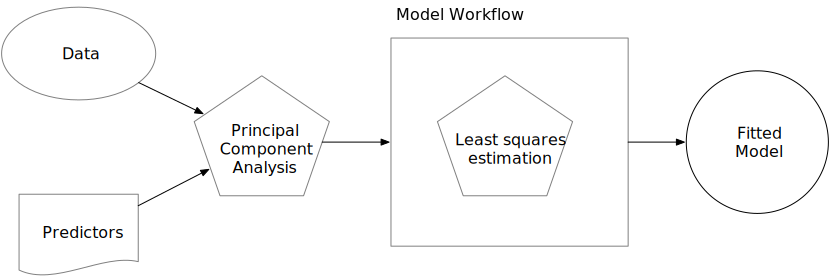
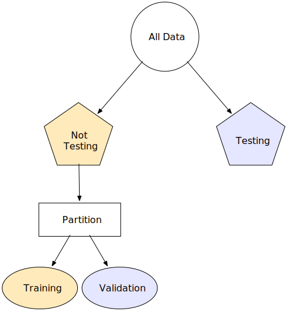
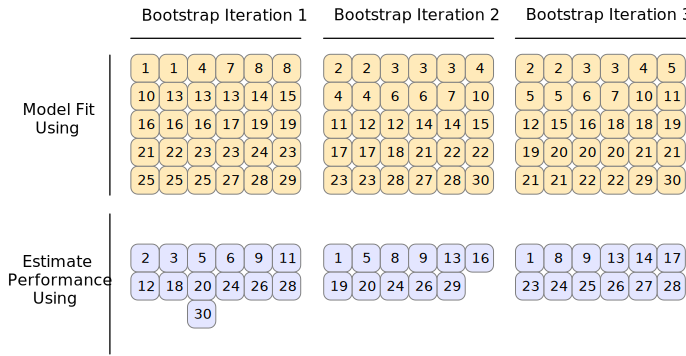
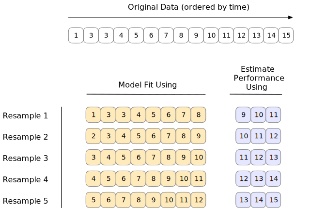

---
output_yaml:
  - _output.yml
---

<!-- Add a couple more of the chapters? Or maybe put them in chapter 11? -->

<!-- Cut the recipe, bake, stuff? Not really needed for chapters 11 and 12. -->

<!-- Replace lm() with stan_glm()? -->


<!-- 2) Each section ends with the code we have done. That seems redundant and confusing. -->

<!-- 3) Need to make the approach here mesh with the approaches used in chapter 11 and 12. What can we cut from here that is not used? How should we change later chapters to be consistent with this modern approach? -->

<!-- 4) I am concerned about the ames_snippets.R code used in the original but, maybe, not needed here. -->


<!-- 7) Deal with the missing references. Need to add them to the bib. -->

<!-- 8) Maybe follow their example with r pkg(dplyr) instead of **dplyr**. -->

# Model Choice

There are many models we could make to explain a given outcome variable. The chapter provides the tools for exploring which model we "ought" to select. We will use these tools in Chapters \@ref(continuous-response) (for continuous outcomes) and \@ref(discrete-response) (for discrete outcomes).


## The Ames housing data {#ames}

Packages:

```{r, message = FALSE}
library(tidyverse)
library(tidymodels)
library(ranger)
data(ames)
```

The **tidymodels** library includes all the necessary libraries, in the same way that **tidyverse** includes libraries like **ggplot2** and **dplyr**. The `ames` data lives in the **modeldata** library, which is part of **tidymodels**. The **ranger** package is used for creating *regression trees*, a type of model which will feature in Chapter \@ref(discrete-response).

The `ames` housing data set contains data on `r format(nrow(ames), big.mark = ",")` properties in Ames, Iowa, including columns related to 

 * house characteristics (bedrooms, garage, fireplace, pool, porch, etc.),
 * location (neighborhood),
 * lot information (zoning, shape, size, etc.),
 * ratings of condition and quality, and
 * sale price.


It makes sense to start with the outcome we want to predict: the last sale price of the house (in USD): 

<!-- DK: Clean up these plots. -->

```{r}
ggplot(ames, aes(x = Sale_Price)) + 
  geom_histogram(bins = 50) +
  scale_x_continuous(breaks = c(0, 200000, 400000, 600000),
                     labels = scales::dollar_format()) +
  labs(title = "Sales Prices for Homes in Ames, Iowa",
       subtitle = "Skewed distribution suggests need for a log transformation",
       x = "Sales Price",
       y = "Number")
```

The data are right-skewed; there are more inexpensive houses than expensive ones. The median sale price was \$`r format(median(ames$Sale_Price), big.mark = ",")` and the most expensive house was \$`r format(max(ames$Sale_Price), big.mark = ",")`. When modeling this outcome, a strong argument can be made that the price should be log-transformed. The advantages of doing this are that no houses would be predicted with negative sale prices and that errors in predicting expensive houses will not have an undue influence on the model. 

<!-- DK: Do we need to discuss logs, either here or earlier in the book? -->

```{r}
ggplot(ames, aes(x = Sale_Price)) + 
  geom_histogram(bins = 50) +
  scale_x_log10(breaks = c(0, 50000, 100000, 200000, 400000),
                     labels = scales::dollar_format()) +
  labs(title = "Sales Prices for Homes in Ames, Iowa",
       subtitle = "Using logs makes for a more sensible distribution",
       x = "Sales Price",
       y = "Number")

```

While not perfect, this will probably result in better models than using the untransformed data.  _From this point on_, the outcome column is pre-logged in the `ames` data frame: 

<!-- DK: Should we just define this as log in the original data? Would be one less thing for students to deal with. -->

```{r}
ames <- ames %>% 
  mutate(Sale_Price = log10(Sale_Price))
```

<!-- DK: Delete this interesting geographic stuff? It is good but the chapter is too long. -->

Another important aspect of these data for our modeling are their geographic locations. This spatial information is contained in the data in two ways: a qualitative `Neighborhood` label as well as quantitative longitude and latitude data. To visualize the spatial information, let's use both together to plot the data on a map and color by neighborhood: 

```{r, echo = FALSE}
knitr::include_graphics("10-model-choice/images/ames.png")
```

We can see a few noticeable patterns. First, there is a void of data points in the center of Ames. This corresponds to Iowa State University. Second, while there are a number of neighborhoods that are geographically isolated, there are others that are adjacent to each other. For example, Timberland is located apart from almost all other neighborhoods:

```{r, echo = FALSE}
knitr::include_graphics("10-model-choice/images/timberland.png")
```

The Meadow Village neighborhood in Southwest Ames is like an island of properties ensconced inside the sea of properties that make up the Mitchell neighborhood: 

```{r, echo = FALSE}
knitr::include_graphics("10-model-choice/images/mitchell.png")
```
 
A detailed inspection of the map also shows that the neighborhood labels are not completely reliable. For example, there are some properties labeled as being in Northridge that are surrounded by houses in the adjacent Somerset neighborhood: 

```{r, echo = FALSE}
knitr::include_graphics("10-model-choice/images/northridge.png")
```

Also, there are ten isolated houses labeled as being in Crawford but which are not close to the majority of the other houses in that neighborhood:

```{r, echo = FALSE}
knitr::include_graphics("10-model-choice/images/crawford.png")
```

Also notable is the "Iowa Department of Transportation (DOT) and Rail Road" neighborhood adjacent to the main road on the east side of Ames. There are several clusters of houses within this neighborhood as well as some longitudinal outliers; the two houses furthest east are isolated from the other locations. 

```{r, echo = FALSE}
knitr::include_graphics("10-model-choice/images/dot_rr.png")
```

It is _critical_ to conduct _exploratory data analysis_ prior to beginning any modeling. These housing data have characteristics that present interesting challenges about how the data should be processed and modeled. We describe many of these in later sections. Some basic questions that could be examined include: 

 * Are there any odd or noticeable things about the distributions of the individual predictors? Is there much skewness or any pathological distributions? 

 * Are there high correlations between predictors? For example, there are multiple predictors related to the size of the house. Are some redundant?

 * Are there associations between predictors and the outcomes? 

Many of these questions will be revisited as these data are used in upcoming examples. 


## Feature engineering with recipes {#recipes}

Feature engineering encompasses activities that reformat predictor values to make them easier for a model to use effectively. This includes transformations and encodings of the data to best represent their important characteristics. Imagine that you have two predictors in a data set that can be more effectively represented in your model of interest as a ratio; creating a new predictor from the ratio of the original two is a simple example of feature engineering. 

Take the location of a house in Ames as a more involved example. There are a variety of ways that this spatial information can be exposed to a model, including neighborhood (a qualitative measure), longitude/latitude, distance to the nearest school or Iowa State University, and so on. When choosing how to encode these data in modeling, we might choose an option we believe most associated with the outcome. The original format of the data (e.g., numeric like distance versus categorical like neighborhood) is also a driving factor in feature engineering choices. 

There are many other examples of preprocessing to build better features for modeling: 

 * Correlation between predictors can be reduced via feature extraction or the removal of some predictors. 
 
 * When some predictors have missing values, they can be imputed using a sub-model.
 
 * Models that use variance-type measures may benefit from coercing the distribution of some skewed predictors to be symmetric by estimating a transformation. 


The **recipes** package combines different feature engineering and preprocessing tasks into a single object and then applies these transformations to different data sets. 

### Splitting data

Before making a recipe, we should organize our data.

The primary approach for empirical model validation is to split the existing pool of data into two distinct sets. Some observations are used to develop and optimize the model. This _training set_ is usually the majority of the data. These data are a sandbox for model building where different models can be fit, feature engineering strategies are investigated, and so on. We as modeling practitioners spend the vast majority of the modeling process using the training set as the substrate to develop the model.  

The other portion of the observations are placed into the _test set_. This is held in reserve until one or two models are chosen as the methods that are mostly likely to succeed. The test set is then used as the final arbiter to determine the efficacy of the model. It is critical to only look at the test set once; otherwise, it becomes part of the modeling process. 


Suppose we allocate 80% of the data to the training set and the remaining 20% for testing.  The most common method is to use simple random sampling. The **rsample** package has tools for making data splits such as this; the function `intial_split()` was created for this purpose. It takes the data frame as an argument as well as the proportion to be placed into training. We use `set.seed()` so that the results can be reproduced later. Create a data split which we will use throughout this chapter.

```{r}
set.seed(123)

ames_split <- initial_split(ames, prob = 0.80)
ames_split
```

The printed information denotes the amount of data in the training set ($n = `r format(nrow(training(ames_split)), big.mark = ",")`$), the amount in the test set ($n = `r format(nrow(testing(ames_split)), big.mark = ",")`$), and the size of the original pool of samples  ($n = `r format(nrow(ames), big.mark = ",")`$). 

The object `ames_split` is an `rsplit` object and only contains the partitioning information; to get the resulting data sets, we apply two more functions:

```{r}
ames_train <- training(ames_split)
ames_test  <-  testing(ames_split)

dim(ames_train)
```

These objects are data frames with the same _columns_ as the original data but only the appropriate _rows_ for each set. 

The amount of data that should be allocated when splitting the data is highly dependent on the context of the problem at hand. Too much data in the training set lowers the quality of the performance estimates. Conversely, too much data in the test set handicaps the model's ability to find appropriate parameter estimates. 


### A simple recipe for the Ames housing data 

In this section, we will focus on a small subset of the predictors available in the Ames housing data: 

 * The neighborhood (qualitative, with `r length(levels(ames_train$Neighborhood))` neighborhoods in the training set)

 * The general living area (continuous, named `Gr_Liv_Area`)

 * The year built (`Year_Built`)

 * The type of building (`Bldg_Type`)

<!-- DK: Introduce lm here? Or earlier? -->

Suppose that an initial ordinary linear regression model were fit to these data. A  standard call to `lm()`, a function similar to `stan_glm()`, might look like:

```{r, eval = FALSE}
lm(Sale_Price ~ Neighborhood + log10(Gr_Liv_Area) + Year_Built + Bldg_Type)
```

What the formula above does can be decomposed into a series of _steps_:

1. Sale price is defined as the outcome while neighborhood, general living area, the year built, and building type variables are all defined as predictors. 

1. A log transformation is applied to the general living area predictor. 

1. The neighborhood and building type columns are converted from a non-numeric format to a numeric format (since least squares requires numeric predictors). 

The formula method will apply these data manipulations to any data, including new data, that are passed to the `predict()` function. 

A recipe is also an object that defines a series of steps for data processing. Unlike the formula method inside a modeling function, the recipe defines the steps without immediately executing them; it is only a specification of what _should_ be done. Here is a recipe equivalent to the formula above:

```{r}
library(tidymodels) # Includes the recipes package

simple_ames <- 
  recipe(Sale_Price ~ Neighborhood + Gr_Liv_Area + 
           Year_Built + Bldg_Type,
         data = ames_train) %>%
  step_log(Gr_Liv_Area, base = 10) %>% 
  step_dummy(all_nominal())
simple_ames
```

Let's break this down: 

1. The call to `recipe()` with a formula tells the recipe the _roles_ of the variables (e.g., predictor, outcome). It only uses the data to determine the data types for the columns. 

1. `step_log()` declares that `Gr_Liv_Area` should be log transformed. 

1. `step_dummy()` is used to specify which variables should be converted from a qualitative format to a quantitative format, in this case, using dummy or indicator variables. An indicator or dummy variable is a binary numeric variable (a column of ones and zeroes) that encodes qualitative information; we will dig deeper into these kinds of variables in Section \@ref(dummies). 

The function `all_nominal()` captures the names of any columns that are currently factor or character (i.e., nominal) in nature. This is a **dplyr** selector function similar to `starts_with()` or `matches()` but which can only be used inside of a recipe. 


What is the advantage to using a recipe? There are a few, including:

 * These computations can be recycled across models since they are not tightly coupled to the modeling function. 
 
 * A recipe enables a broader set of data processing choices than formulas can offer. 
 
 * The syntax can be very compact. For example, `all_nominal()` can be used to capture many variables for specific types of processing while a formula would require each to be explicitly listed. 
 
 * All data processing can be captured in a single R object instead of in scripts that are repeated, or even spread across different files.  
 


### Encoding qualitative data in a numeric format  {#dummies}

One of the most common feature engineering tasks is transforming nominal or qualitative data (factors or characters) so that they can be encoded or represented numerically. Sometimes we can alter the factor levels of a qualitative column in helpful ways _prior_ to such a transformation. For example, `step_unknown()` can be used to change missing values to a dedicated factor level. Similarly, if we anticipate that a new factor level may be encountered in future data, `step_novel()` can allot a new level for this purpose. 

Additionally, `step_other()` can be used to analyze the frequencies of the factor levels in the training set and convert infrequently occurring values to a catch-all level of "other", with a specific threshold that can be specified. A good example is the `Neighborhood` predictor in our data:

```{r}
ggplot(ames_train, aes(y = Neighborhood)) + 
  geom_bar() + 
  labs(y = NULL)
```

Here there are two neighborhoods that have less than five properties in the training data; in this case, no houses at all in the Landmark neighborhood were included in the training set. For some models, it may be problematic to have dummy variables with a single non-zero entry in the column. At a minimum, it is highly improbable that these features would be important to a model. If we add `step_other(Neighborhood, threshold = 0.01)` to our recipe, the bottom 1% of the neighborhoods will be lumped into a new level called "other". In this training set, this will catch `r sum(table(ames_train$Neighborhood)/nrow(ames_train) <= .01)` neighborhoods.  

For the Ames data, we can amend the recipe to use:

```{r}
simple_ames <- 
  recipe(Sale_Price ~ Neighborhood + Gr_Liv_Area + Year_Built + Bldg_Type,
         data = ames_train) %>%
  step_log(Gr_Liv_Area, base = 10) %>% 
  step_other(Neighborhood, threshold = 0.01) %>% 
  step_dummy(all_nominal())
```


There are a few strategies for converting a factor predictor to a numeric format. The most common method is to create "dummy" or indicator variables. Let's take the predictor in the Ames data for the building type, which is a factor variable with five levels. For dummy variables, the single `Bldg_Type` column would be replaced with four numeric columns whose values are either zero or one. These binary variables represent specific factor level values. In R, the convention is to _exclude_ a column for the first factor level (`OneFam`, in this case). The `Bldg_Type` column would be replaced with a column called `TwoFmCon` that is one when the row has that value and zero otherwise. Three other columns are similarly created: 

<!-- DK: The below code, which is not shown, is the only place we use prep() and bake(). Should we get rid of them/this? For now, it does not matter since students can't see the code. -->

```{r, echo = FALSE}
show_rows <- 
  ames_train %>% 
  mutate(.row = row_number()) %>% 
  group_by(Bldg_Type) %>% dplyr::select(Bldg_Type, .row) %>% 
  slice(1) %>% 
  pull(.row)

recipe(~Bldg_Type, data = ames_train) %>% 
  step_mutate(`Raw Data` = Bldg_Type) %>% 
  step_dummy(Bldg_Type, 
             naming = function(var, lvl, ordinal = FALSE, sep = "_") lvl) %>% 
  prep() %>% 
  bake(ames_train) %>% 
  slice(show_rows) %>% 
  arrange(`Raw Data`)
```


Why not all five? The most basic reason is simplicity; if you know the value for these four columns, you can determine the last value because these are mutually exclusive categories. More technically, the classical justification is that a number of models, including ordinary linear regression, have numerical issues when there are linear dependencies between columns. If all five building type indicator columns are included, they would add up to the intercept column (if there is one). This would cause an issue, or perhaps an outright error, in the underlying matrix algebra.  


Different recipe steps can have different effects on columns of the data. For example, `step_log()` modifies a column in-place without changing the name. Other steps, such as `step_dummy()` eliminate the original data column and replace it with one or more columns with different names. This behavior depends on the type of operation being done. 


### Interaction terms

Interaction effects involve two or more predictors. Such an effect occurs when one predictor has an effect on the outcome that is contingent on one or more other predictors. For example, if you were trying to predict your morning commute time, two potential predictors could be the amount of traffic and the time of day. However, the relationship between commute time and the amount of traffic is different for different times of day. In this case, you could add an interaction term between the two predictors to the model along with the original two predictors (which are called the "main effects"). Numerically, an interaction term between predictors is encoded as their product. Interactions are only defined in terms of their effect on the outcome and can be combinations of different types of data (e.g., numeric, categorical, etc). 

After exploring the Ames training set, we might find that the regression slopes for the general living area differ for different building types: 

```{r}
ggplot(ames_train, aes(x = Gr_Liv_Area, y = 10^Sale_Price)) + 
  geom_point(alpha = .2) + 
  facet_wrap(~ Bldg_Type) + 
  geom_smooth(method = lm, formula = y ~ x, se = FALSE, col = "red") + 
  scale_x_log10() + 
  scale_y_log10() + 
  labs(x = "General Living Area", y = "Sale Price (USD)")
```

How are interactions specified? Recipes are explicit and sequential. With the current recipe, `step_dummy()` has already created dummy variables. How would we combine these for an interaction? The additional step would look like `step_interact(~ interaction terms)` where the terms on the right-hand side of the tilde are the interactions. These can include selectors, so it would be appropriate to use:

```{r}
simple_ames <- 
  recipe(Sale_Price ~ Neighborhood + Gr_Liv_Area + Year_Built + Bldg_Type,
         data = ames_train) %>%
  step_log(Gr_Liv_Area, base = 10) %>% 
  step_other(Neighborhood, threshold = 0.01) %>% 
  step_dummy(all_nominal()) %>% 
  # Gr_Liv_Area is on the log scale from a previous step
  step_interact( ~ Gr_Liv_Area:starts_with("Bldg_Type_") )
```

Additional interactions can be specified in this formula by separating them by `+`. Also note that the recipe will only utilize interactions between different variables; if the formula uses `var_1:var_1`, this term will be ignored. 

Our code so far:

```{r, message=FALSE}
library(tidymodels)
data(ames)
ames <- mutate(ames, Sale_Price = log10(Sale_Price))

set.seed(123)
ames_split <- initial_split(ames, prob = 0.80, strata = Sale_Price)
ames_train <- training(ames_split)
ames_test  <- testing(ames_split)

ames_rec <- 
  recipe(Sale_Price ~ Neighborhood + Gr_Liv_Area + Year_Built + Bldg_Type + 
           Latitude + Longitude, data = ames_train) %>%
  step_log(Gr_Liv_Area, base = 10) %>% 
  step_other(Neighborhood, threshold = 0.01) %>% 
  step_dummy(all_nominal()) %>% 
  step_interact( ~ Gr_Liv_Area:starts_with("Bldg_Type_") ) 
```

## Fitting models with parsnip {#models}

The **parsnip** package provides a fluent and standardized interface for a variety of different models. In this section, we both give some motivation for why a common interface is beneficial and show how to use the package. 
 
### Create a model

Once the data have been encoded in a format ready for a modeling algorithm, such as a numeric matrix, they can be used in the model building process.  

Suppose that a linear regression model was our initial choice for the model. This is equivalent to specifying that the outcome data is numeric and that the predictors are related to the model in terms of simple slopes and intercepts: 

$$y_i = \beta_0 + \beta_1 x_{1i} + \ldots + \beta_p x_{pi}$$

There are a variety of methods that can be used to estimate the model parameters: 

 * _Ordinary linear regression_ uses the traditional method of least squares to solve for the model parameters. 

 * _Regularized linear regression_ adds a penalty to the least squares method to encourage simplicity by removing predictors and/or shrinking their coefficients towards zero. This can be executed using Bayesian or non-Bayesian techniques. 

In R, the **stats** package can be used for the first case. The syntax for `lm()` is 

```r
model <- lm(formula, data, ...)
```

where `...` symbolizes other options to pass to `lm()`. 

To estimate a Bayesian model, we use `stan_glm()` from the **rstanarm** package, as we have done in the last few chapters. 

```r
model <- stan_glm(formula, 
                  data, 
                  family = "gaussian", ...)
```

A popular non-Bayesian approach to regression is the glmnet model. Its syntax is:

```r
model <- glmnet(x = matrix, 
                y = vector, 
                family = "gaussian", ...)
```

In this case, the predictor data must already be formatted into a numeric matrix; there is only and `x`/`y` method and no formula method. 

Note that these interfaces are heterogeneous in either how the data are passed to the model function or in terms of their arguments. The first issue is that, to fit models across different packages, the data must be formatted in different ways. `lm()` and `stan_glm()` only have formula interfaces while `glmnet()` does not. For other types of models, the interfaces may be even more disparate. For a person trying to do data analysis, these differences require the memorization of each package's syntax and can be very frustrating. 

For tidymodels, the approach to specifying a model is intended to be more unified: 

1. **Specify the _type_ of model based on its mathematical structure**. 

2. **Specify the _engine_ for fitting the model.** Most often this reflects the software package that should be used. 

3. **When required, declare the _mode_ of the model.** The mode reflects the type of prediction outcome. For numeric outcomes, the mode is _regression_; for qualitative outcomes, it is _classification_. Note that **parsnip** constrains the outcome column of a classification models to be encoded as a _factor_; using binary numeric values will result in an error. If a model can only create one type of model, such as linear regression, the mode is already set. 

These specifications are built _without referencing the data_. For example, for the three cases above: 

```{r}
linear_reg() %>% 
  set_engine("lm")

linear_reg() %>% 
  set_engine("glmnet") 

linear_reg() %>% 
  set_engine("stan")
```


Once the details of the model have been specified, the model estimation can be done using a formula with the `fit()` function. The **parsnip** package allows the user to be indifferent to the interface of the underlying model. 


Let's walk through how to predict the sale price of houses in the Ames data as a function of only longitude and latitude. 


```{r}
lm_model <- 
  linear_reg() %>% 
  set_engine("lm")

# Recall that Sale_Price has been pre-logged

lm_form_fit <- 
  lm_model %>% 
  fit(Sale_Price ~ Longitude + Latitude, data = ames_train)
    
lm_form_fit
```


Not only does **parsnip** enable a consistent model interface for different packages, it also provides consistency in the _model arguments_. Modeling functions in **parsnip** separate model arguments into two categories: 

 * _Main arguments_ are more commonly used and tend to be available across engines. 

 * _Engine arguments_ are either specific to a particular engine or used more rarely. 


### Use the model results

<!-- DK: Delete this section? -->

Once the model is created and fit, we can use the results in a variety of ways; we might want to plot, print, or otherwise examine the model output. Several quantities are stored in a **parsnip** model object, including the fitted model. This can be found in an element called `fit`, which can be returned using the `purrr::pluck()` function:

<!-- DK: Investigate pluck nonsense. -->

```{r}
lm_form_fit %>% 
  purrr::pluck("fit")
```

Normal methods can be applied to this object, such as printing, plotting, and so on.

One issue with some existing methods in base R is that the results are stored in a manner that may not be the most useful. As a solution, the **broom** package has methods to convert many types of model objects to a tidy structure. For example, using the `tidy()` method on the linear model produces:


```{r}
tidy(lm_form_fit)
```
 
The column names are standardized across models and do not contain any additional data (such as the type of statistical test). The data previously contained in the row names are now in a column called `terms` and so on. One important principle in the tidymodels ecosystem is that a function should return values that are _predictable, consistent, and unsurprising_. 


### Make predictions {#parsnip-predictions}

Another area where **parsnip** diverges from conventional R modeling functions is the format of values returned from `predict()`. For predictions, **parsnip** always conforms to the following rules: 

 1. The results are always a tibble.
 2. The column names of the tibble are always predictable. 
 3. There are always as many rows in the tibble as there are in the input data set. 

For example, when numeric data are predicted: 

```{r}
ames_test_small <- ames_test %>% slice(1:5)
predict(lm_form_fit, new_data = ames_test_small)
```

The row order of the predictions are always the same as the original data. Why is there a leading dot in some of the column names? Some tidyverse and tidymodels functions have arguments and return values which contain periods. This is to protect against merging data with duplicate names. There are some data sets that contain predictors named `pred`! 


These three rules make it easier to merge predictions with the original data: 

```{r}
ames_test_small %>% 
  select(Sale_Price) %>% 
  bind_cols(predict(lm_form_fit, ames_test_small)) %>% 
  
  # Add 95% prediction intervals to the results:
  
  bind_cols(predict(lm_form_fit, ames_test_small, type = "pred_int")) 
```


For the second tidymodels prediction rule, the predictable column names for different types of predictions are: 

```{r, echo = FALSE}
  tribble(
    ~ `type value`, ~ `column name(s)`,
    "`numeric`", "`.pred`",
    "`class`", "`.pred_class`",
    "`prob`", "`.pred_{class levels}`",
    "`conf_int`", "`.pred_lower`, `.pred_upper`",
    "`pred_int`", "`.pred_lower`, `.pred_upper`"
  ) 
```

The third rule regarding the number of rows in the output is critical. For example, if any rows of the new data contain missing values, the output will be padded with missing results for those rows. 

A main advantage of standardizing the model interface and prediction types in **parsnip** is that, when different models are used, the syntax is identical. Suppose that we used a decision tree to model the Ames data. Outside of the model specification, there are no significant differences in the code pipeline: 

```{r}
tree_model <- 
  decision_tree(min_n = 2) %>% 
  set_engine("rpart") %>% 
  set_mode("regression")

tree_fit <- 
  tree_model %>% 
  fit(Sale_Price ~ Longitude + Latitude, data = ames_train)

ames_test_small %>% 
  select(Sale_Price) %>% 
  bind_cols(predict(tree_fit, ames_test_small))
```

This demonstrates the benefit of homogenizing the data analysis process and syntax across different models. It enables users to spend their time on the results and interpretation rather than having to focus on the syntactical differences between R packages. 


## A model workflow {#workflows}

In the previous two sections, we discussed the **recipes** and **parsnip** packages. These packages can be used to prepare the data for analysis and fitting the model. This chapter introduces a new object called a _model workflow_. The purpose of this object is to encapsulate the major pieces of the modeling _process_. The workflow is important in two ways. First, using a workflow object encourages good methodology since it is a single point of entry to the estimation components of a data analysis. Second, it enables the user to better organize their projects.  


### Where does the model begin and end? {#begin-model-end}

So far, when we have used the term "the model", we have meant a structural equation that relates some predictors to one or more outcomes. Let's consider again linear regression as an example. The outcome data are denoted as $y_i$, where there are $i = 1 \ldots n$ samples in the training set. Suppose that there are $p$ predictors $x_{i1}, \ldots, x_{ip}$ that are used in the model. Linear regression produces a model equation of 

$$ \hat{y}_i = \hat{\beta}_0 + \hat{\beta}_1x_{i1} + \ldots + \hat{\beta}_px_{ip} $$

While this is a _linear_ model, it is only linear in the parameters. The predictors could be nonlinear terms like $log(x_i)$. 

For some data sets that are straightforward in nature, fitting the model itself may be the entire process. However, there are a variety of choices and additional steps that often occur _before_ the model is fit:

* While our example model has $p$ predictors, it is common to start with more than $p$ candidate predictors. Through exploratory data analysis or using domain knowledge, some of the predictors may be excluded from the analysis. In other cases, a feature selection algorithm may be used to make a data-driven choice about which predictors to include. 

* There are times when the value of an important predictor is missing. Rather than eliminating this sample from the data set, the missing value could be _imputed_ using other values in the data. For example, if $x_1$ were missing but was correlated with predictors $x_2$ and $x_3$, an imputation method could estimate the missing $x_1$ observation from the values of $x_2$ and $x_3$. 

* It may be beneficial to transform the scale of a predictor. If there is not _a priori_ information on what the new scale should be, we can estimate the proper scale using a statistical transformation technique, the existing data, and some optimization criterion. Other transformations, such as PCA, take groups of predictors and transform them into new features that are used as the predictors.

While the examples above are related to steps that occur before the model fit, there may also be operations that occur _after_ the model is created. When a classification model is created where the outcome is binary (e.g., `event` and `non-event`), it is customary to use a 50% probability cutoff to create a discrete class prediction, also known as a "hard prediction". For example, a classification model might estimate that the probability of an event was 62%. Using the typical default, the hard prediction would be `event`. However, the model may need to be more focused on reducing false positive results (i.e., where true non-events are classified as events). One way to do this is to raise the cutoff from 50% to some greater value. This increases the level of evidence required to call a new sample an event. While this reduces the true positive rate (which is bad), it may have a more dramatic effect on reducing false positives. The choice of the cutoff value should be optimized using data. This is an example of a _post-processing_ step that has a significant effect on how well the model works, even though it is not contained in the model fitting step. 

It is important to focus on the broader _modeling process_, instead of only fitting the specific model used to estimate parameters. This broader process includes any preprocessing steps, the model fit itself, as well as potential post-processing activities. In this book, we will refer to this broader process as the **model workflow** and include in it any data-driven activities that are used to produce a final model equation. 


In other software, such as Python or Spark, similar collections of steps are called  _pipelines_. In tidymodels, the term "pipeline" already connotes a sequence of operations chained together with a pipe operator (such as `%>%`). Rather than using ambiguous terminology in this context, we call the sequence of computational operations related to modeling **workflows**. 


Binding together the analytical components of a data analysis is important for another reason. We will learn how to accurately measure performance, as well as how to optimize structural parameters (i.e. model tuning). To correctly quantify model performance on the training set, we recommend using _resampling_ methods. To do this properly, no data-driven parts of the analysis should be excluded from validation. To this end, the workflow must include all significant estimation steps.

To illustrate, consider PCA signal extraction. This is a way to replace correlated predictors with new artificial features that are uncorrelated and capture most of the information in the original set. The new features would be used as the predictors and least squares regression could be used to estimate the model parameters. 

There are two ways of thinking about the model workflow. The _incorrect_ method would be to think of the PCA preprocessing step as _not being part of the modeling process_: 

```{r, echo = FALSE}

```

The fallacy here is that, although PCA does significant computations to produce the components, its operations are assumed to have no uncertainty associated with them. The PCA components are treated as _known_ and, if not included in the model workflow, the effect of PCA could not be adequately measured. 

An _appropriate_ approach would be: 

```{r, echo = FALSE}
knitr::include_graphics("10-model-choice/images/proper-workflow.svg")
```

In this way, the PCA preprocessing is considered part of the modeling process. 

### Workflow basics

The **workflows** package allows the user to bind modeling and preprocessing objects together. Let's start again with the Ames data and a simple linear model:

```{r}
library(tidymodels)  # Includes the workflows package

lm_model <- 
  linear_reg() %>% 
  set_engine("lm")
```

A workflow always requires a **parsnip** model object:

```{r}
lm_wflow <- 
  workflow() %>% 
  add_model(lm_model)

lm_wflow
```

Notice that we have not yet specified how this workflow should preprocess the data: `Preprocessor: None`.

If our model were very simple, a standard R formula can be used as a preprocessor: 

```{r workflows-form}
lm_wflow <- 
  lm_wflow %>% 
  add_formula(Sale_Price ~ Longitude + Latitude)

lm_wflow
```

Workflows have a `fit()` method that can be used to create the model. Using the objects created previously:

```{r}
lm_fit <- fit(lm_wflow, ames_train)
lm_fit
```

We can also `predict()` on the fitted workflow:

```{r}
predict(lm_fit, ames_test %>% slice(1:3))
```

The `predict()` method follows all of the same rules and naming conventions that we described for the **parsnip** package. 


### Workflows and recipes

<!-- DK: Simplify this. No need to teach update() stuff trickery. -->

Instead of using model formulas, recipe objects can also be used to preprocess data for modeling. Previously, we summarized a recipe that specified several preprocessing and feature engineering steps. These are encapsulated inside the object `ames_rec` and are attached to the workflow:

```{r, error = TRUE}
lm_wflow %>% 
  add_recipe(ames_rec)
```

That did not work! We can only have one preprocessing method at a time, so we need to remove the formula before adding the recipe. 

```{r workflows-add-recipe}
lm_wflow <- 
  lm_wflow %>% 
  remove_formula() %>% 
  add_recipe(ames_rec)
lm_wflow
```

Use `fit()` to complete the model and `predict()` to create predictions from the fitted model.


```{r}
lm_fit <- fit(lm_wflow, ames_train)

predict(lm_fit, ames_test %>% slice(1:3))
```

We have learned that the modeling process encompasses more than just estimating the parameters of an algorithm that connects predictors to an outcome. This process also includes preprocessing steps and operations taken after a model is fit. We introduced a concept called a **model workflow** that can capture the important components of the modeling process. 

For the Ames data, the updated code:

```{r, message=FALSE}
library(tidymodels)
data(ames)

ames <- mutate(ames, Sale_Price = log10(Sale_Price))

set.seed(123)
ames_split <- initial_split(ames, prob = 0.80, strata = Sale_Price)
ames_train <- training(ames_split)
ames_test  <-  testing(ames_split)

ames_rec <- 
  recipe(Sale_Price ~ Neighborhood + Gr_Liv_Area + Year_Built + Bldg_Type + 
           Latitude + Longitude, data = ames_train) %>%
  step_log(Gr_Liv_Area, base = 10) %>% 
  step_other(Neighborhood, threshold = 0.01) %>% 
  step_dummy(all_nominal()) %>% 
  step_interact( ~ Gr_Liv_Area:starts_with("Bldg_Type_") )

lm_model <- linear_reg() %>% set_engine("lm")

lm_wflow <- 
  workflow() %>% 
  add_model(lm_model) %>% 
  add_recipe(ames_rec)

lm_fit <- fit(lm_wflow, ames_train)
```

## Judging model effectiveness {#performance}


Once we have a model, we need to know how well it works. A quantitative approach for estimating effectiveness allows us to understand the model, to compare different models, or to tweak the model to improve performance. Our focus in tidymodels is on _empirical validation_; this usually means using data that were not used to create the model as the substrate on which we measure effectiveness. 


The choice of which metrics to examine can be critical. For example, two common metrics for regression models are the root mean squared error (RMSE) and the coefficient of determination (a.k.a. $R^2$). The former measures _accuracy_ while the latter measures _correlation_. These are not necessarily the same thing. This figure demonstrates the difference between the two: 

```{r, echo = FALSE}
set.seed(234)
n <- 200
obs <- runif(n, min = 2, max = 20)

reg_ex <- 
  tibble(
    observed = c(obs, obs),
    predicted = c(obs + rnorm(n, sd = 1.5), 5 + .5 * obs + rnorm(n, sd = .5)),
    approach = rep(c("RMSE optimized", "R^2 optimized"), each = n)
  ) %>% 
  mutate(approach = factor(approach, levels = c("RMSE optimized", "R^2 optimized")))

ggplot(reg_ex, aes(x = observed, y = predicted)) + 
  geom_abline(lty = 2) + 
  geom_point(alpha = 0.5) + 
  coord_obs_pred() + 
  facet_wrap(~ approach)
```

A model optimized for RMSE has more variability but has relatively uniform accuracy across the range of the outcome. The right panel shows that there is a tighter correlation between the observed and predicted values but this model performs poorly in the tails. 

This section will largely focus on the **yardstick** package. Before illustrating syntax, let's explore whether empirical validation using performance metrics is worthwhile when a model is focused on causation rather than prediction. 

### Performance metrics and causal models

<!-- DK: We could put these sections at the start of their respective chapters. -->

The effectiveness of any given model depends on how the model will be used. A causal model is used primarily to understand relationships, and typically is discussed with a strong focus on the choice (and validity) of probabilistic distributions and other generative qualities that define the model. For a model used primarily for prediction, by contrast, predictive strength is primary and concerns about underlying statistical qualities may be less important. Predictive strength is usually focused on how close our predictions come to the observed data, i.e., fidelity of the model predictions to the actual results. This section focuses on functions that can be used to measure predictive strength. However, our advice for those developing causal models is to use these techniques _even when the model will not be used with the primary goal of prediction_. 

A longstanding issue with the practice of statistics is that, with a focus purely on causation, it is difficult to assess the credibility of a model. For example, consider Alzheimer's disease data used to study the factors that influence cognitive impairment. Assume that we build a model, using the standard statistical approach. We would, normally, not even be required to calculate how closely this model fits the actual data. 

<!-- DK: This argument is important but awkwardly done. -->

Using resampling methods, we can estimate the accuracy of this model to be about 73.3%. Accuracy is often a poor measure of model performance; we use it here because it is commonly understood. If the model has 73.3% fidelity to the data, should we trust the conclusions produced by the model? We might think so until we realize that the baseline rate of non-impaired patients in the data is 72.7%. This means that, despite our statistical analysis, a fancy model appears to be *only 0.6% better than a simple heuristic that always predicts patients to be unimpaired*, irregardless of the observed data. 

<!-- DK: Never seen this sort of object before. -->

```{block, type = "rmdnote"}
The point of this analysis is to demonstrate the idea that **optimization of statistical characteristics of the model does not imply that the model fits the data well.** Even for purely inferential models, some measure of fidelity to the data should accompany the inferential results. Using this, the consumers of the analyses can calibrate their expectations of the results of the statistical analysis. 
```

<!-- DK: Next edition: Bring back multi-classification -->

In the remainder of this section, general approaches for evaluating models via empirical validation are discussed. These approaches are grouped by the nature of the outcome data: purely numeric (Chapter \@ref(continuous-response)) and binary classes (Chapter \@ref(discrete-response)). 

### Regression metrics 

Recall from Section \@ref(parsnip-predictions) that tidymodels prediction functions produce tibbles with columns for the predicted values. These columns have consistent names, and the functions in the **yardstick** package that produce performance metrics have consistent interfaces. The functions are data frame-based, as opposed to vector-based, with the general syntax of: 

```r
function(data, truth, ...)
```

where `data` is a data frame or tibble and `truth` is the column with the observed outcome values. The ellipses or other arguments are used to specify the column(s) containing the predictions. 


To illustrate, let's evaluate the model we have constructed for the Ames house price data. Recall that the `lm_fit` object was a linear regression model whose predictor set was supplemented with an interaction term. It was created from a training set (named `ames_train`). Although we do not advise using the test set at this juncture of the modeling process, it will be used to illustrate functionality and syntax. The data frame `ames_test` consists of `r nrow(ames_test)` properties. To start, let's produce predictions: 

<!-- DK: Is this correct? The pipe within new_data? -->

```{r}
ames_test_res <- predict(lm_fit, new_data = ames_test %>% 
                           select(-Sale_Price))
ames_test_res
```

The predicted numeric outcome from the regression model is named `.pred`. Let's match the predicted values with their corresponding observed outcome values: 

```{r}
ames_test_res <- bind_cols(ames_test_res, ames_test %>% select(Sale_Price))
ames_test_res
```

Note that both the predicted and observed outcomes are in log10 units. It is best practice to analyze the predictions on the transformed scale (if one were used) even if the predictions are reported using the original units. 

Let's plot the data before computing metrics: 

```{r}
ggplot(ames_test_res, aes(x = Sale_Price, y = .pred)) + 
  # Create a diagonal line:
  geom_abline(lty = 2) + 
  geom_point(alpha = 0.5) + 
  labs(y = "Predicted Sale Price (log10)", x = "Sale Price (log10)") +
  # Scale and size the x- and y-axis uniformly:
  coord_obs_pred()
```

There is one property that is substantially over-predicted. 

Let's compute the root mean squared error for this model using the `rmse()` function: 

```{r}
rmse(ames_test_res, truth = Sale_Price, estimate = .pred)
```

The output above shows the standard format of the output of **yardstick** functions. Metrics for numeric outcomes usually have a value of "standard" for the `.estimator` column. Examples with different values for this column are shown below.

To compute multiple metrics at once, we can create a _metric set_. Let's add $R^2$ and the mean absolute error: 

```{r}
ames_metrics <- metric_set(rmse, rsq, mae)
ames_metrics(ames_test_res, truth = Sale_Price, estimate = .pred)
```

This tidy data format stacks the metrics vertically.

### Resampling for evaluating performance  {#resampling}

We usually need to understand the effectiveness of the model _before using the test set_.  In this section, we describe an approach called resampling that can fill this gap. Resampling estimates of performance can generalize to new data. The next chapter complements this one by demonstrating statistical methods that compare resampling results. 

To motivate this chapter, the next section demonstrates how naive performance estimates can often fail. 

### The resubstitution approach {#resampling-resubstition}

Use the `ames` data, we have a recipe object named `ames_rec`, a linear model, and a workflow using that recipe and a model called `lm_wflow`. This workflow was fit on the training set, resulting in `lm_fit`. 

For a comparison to this linear model, we can also fit a different type of model. _Random forests_ are a tree ensemble method that operate by creating a large number of decision trees from slightly different versions of the training set. This collection of trees makes up the ensemble. When predicting a new sample, each ensemble member makes a separate prediction. These are averaged to create the final ensemble prediction for the new data point. 

Random forest models are very powerful and they can emulate the underlying data patterns very closely. While this model can be computationally intensive, it is very low-maintenance. Very little preprocessing is required.

Using the same predictor set as the linear model (without the extra preprocessing steps), we can fit a random forest model to the training set using via the **ranger** package. This model requires no preprocessing so a simple formula can be used:

```{r resampling-rand-forest-spec}
rf_model <- 
  rand_forest(trees = 1000) %>% 
  set_engine("ranger") %>% 
  set_mode("regression")

rf_wflow <- 
  workflow() %>% 
  add_formula(
    Sale_Price ~ Neighborhood + Gr_Liv_Area + Year_Built + Bldg_Type + 
      Latitude + Longitude) %>% 
  add_model(rf_model) 

rf_fit <- rf_wflow %>% fit(data = ames_train)
```

How should the two models be compared? For demonstration, we will predict the training set to produce what is known as the "apparent error rate" or the "resubstitution error rate". This function creates predictions and formats the results: 

```{r resampling-eval-func}
estimate_perf <- function(model, dat) {
  # Capture the names of the objects used
  cl <- match.call()
  obj_name <- as.character(cl$model)
  data_name <- as.character(cl$dat)
  data_name <- gsub("ames_", "", data_name)
  
  # Estimate these metrics:
  reg_metrics <- metric_set(rmse, rsq)
  
  model %>% 
    predict(dat) %>% 
    bind_cols(dat %>% select(Sale_Price)) %>% 
    reg_metrics(Sale_Price, .pred) %>% 
    select(-.estimator) %>% 
    mutate(object = obj_name, data = data_name)
}
```

Both RMSE and R<sup>2</sup> are computed. The resubstitution statistics are: 

```{r resampling-eval-train}
estimate_perf(rf_fit, ames_train)
estimate_perf(lm_fit, ames_train)
```

```{r resampling-eval-train-results, include = FALSE}
all_res <- 
  bind_rows(
    estimate_perf(lm_fit, ames_train),
    estimate_perf(rf_fit, ames_train),
    estimate_perf(lm_fit, ames_test),
    estimate_perf(rf_fit, ames_test)
  ) %>% filter(.metric == "rmse") %>% 
  select(-.metric) %>% 
  pivot_wider(id_cols = object,
              values_from = ".estimate",
              names_from = "data")

tr_ratio <- round(all_res$train[1]/all_res$train[2], 2)
```

Based on these results, the random forest is much more capable of predicting the sale prices; the RMSE estimate is `r tr_ratio`-fold better than linear regression. If these two models were under consideration for this prediction problem, the random forest would probably be chosen. The next step applies the random forest model to the test set for final verification:

```{r resampling-eval-test-rf, cache = TRUE}
estimate_perf(rf_fit, ames_test)
```

The test set RMSE estimate, `r all_res %>% filter(object == "rf_fit") %>% pull("test")`, is **much worse than the training set**  value of `r all_res %>% filter(object == "rf_fit") %>% pull("train")`! Why did this happen? 

Many predictive models are capable of learning complex trends from the data. In statistics, these are commonly referred to as _low bias models_. 


For a low-bias model, the high degree of predictive capacity can sometimes result in the model nearly memorizing the training set data. As an obvious example, consider a 1-nearest neighbor model. It will always provide perfect predictions for the training set no matter how well it truly works for other data sets. Random forest models are similar; re-predicting the training set will always result in an artificially optimistic estimate of performance.  

For both models, this table summarizes the RMSE estimate for the training and test sets: 

```{r resampling-rmse-table, echo = FALSE}
all_res 
```

Notice that the linear regression model is consistent between training and testing, because of its limited complexity.The main take-away from this example is that re-predicting the training set is a **bad idea** for most models. 

If the test set should not be used immediately, and re-predicting the training set is a bad idea, what should be done?  _Resampling methods_, such as cross-validation or validation sets, are the solution.


###  Resampling methods

Resampling methods are empirical simulation systems that emulate the process of using some data for modeling and different data for evaluation. Most resampling methods are iterative, meaning that this process is repeated multiple times. This diagram illustrates how resampling methods generally operate:

```{r, echo=FALSE}
knitr::include_graphics("10-model-choice/images/resampling.svg")
```

**Resampling is only conducted on the training set**. The test set is not involved. For each iteration of resampling, the data are partitioned into two subsamples: 

 * The model is fit with the **analysis set**. 

 * The model is evaluated with the **assessment set**. 

These are somewhat analogous to training and test sets. Our language of _analysis_ and _assessment_ avoids confusion with initial split of the data. These data sets are mutually exclusive. The partitioning scheme used to create the analysis and assessment sets is usually the defining characteristic of the method.

Suppose twenty iterations of resampling are conducted. This means that twenty separate models are fit on the analysis sets and the corresponding assessment sets produce twenty sets of performance statistics. The final estimate of performance for a model is the average of the twenty replicates of the statistics. This average has very good generalization properties and is far better than the resubstituion estimates. 

The next section defines several commonly used methods and discusses their pros and cons. 

####  Cross-validation {#cv}

Cross-validation is a well established resampling method. While there are a number of variations, the most common cross-validation method is _V_-fold cross-validation. The data are randomly partitioned into _V_ sets of roughly equal size (called the "folds"). For illustration, _V_ = 3 is shown below for a data set of thirty training set points with random fold allocations. The number inside the symbols is the sample number:

```{r, echo=FALSE}

```

The color of the symbols represent their randomly assigned folds. Stratified sampling is also an option for assigning folds. 

For 3-fold cross-validation, the three iterations of resampling are illustrated below. For each iteration, one fold is held out for assessment statistics and the remaining folds are substrate for the model. This process continues for each fold so that three models produce three sets of performance statistics. 

```{r, echo=FALSE}
knitr::include_graphics("10-model-choice/images/three-CV-iter.svg")
```

When _V_ = 3, the analysis sets are 2/3 of the training set and each assessment set is a distinct 1/3. The final resampling estimate of performance averages each of the _V_ replicates. 

Using _V_ = 3 is a good choice to illustrate cross-validation but is a poor choice in practice. Values of _V_ are most often 5 or 10; we generally prefer 10-fold cross-validation as a default. 

The primary input is the training set data frame as well as the number of folds (defaulting to 10): 

```{r resampling-ames-cv}
set.seed(55)
ames_folds <- vfold_cv(ames_train, v = 10)
ames_folds
```

The column named `splits` contains the information on how to split the data (similar to the object used to create the initial training/test partition). While each row of `splits` has an embedded copy of the entire training set, R is smart enough not to make copies of the data in memory^[To see this for yourself, try executing `lobstr::obj_size(ames_folds)` and `lobstr::obj_size(ames_train)`. The size of the resample object is much less than ten times the size of the original data.]. The print method inside of the tibble shows the frequency of each: `[2K/220]` indicates that roughly two thousand samples are in the analysis set and 220 are in that particular assessment set. 

To manually retrieve the partitioned data, the `analysis()` and `assessment()` functions return the corresponding data frames: 

```{r resampling-analysis}
# For the first fold:
ames_folds$splits[[1]] %>% 
  analysis() %>% 
  dim()
```

The **tidymodels** packages, such as **tune**, contain high-level user interfaces so that functions like `analysis()` are not generally needed for day-to-day work. Section \@ref(resampling-performance) demonstrates a function to fit a model over these resamples. 

These **rsample** objects also always contain a character column called `id` that labels the partition. Some resampling methods require multiple `id` fields.  


####  Repeated cross-validation {-}

There are a variety of variations on cross-validation. The most important is _repeated_ _V_-fold cross-validation. Depending on the size or other characteristics of the data, the resampling estimate produced by _V_-fold cross-validation may be excessively noisy.  As with many statistical problems, one way to reduce noise is to gather more data. For cross-validation, this means averaging more than _V_ statistics. 

To create _R_ repeats of _V_-fold cross-validation, the same fold generation process is done _R_ times to generate _R_ collections of _V_ partitions. Now, instead of averaging _V_ statistics, $V \times R$ statistics produce the final resampling estimate. Due to the Central Limit Theorem, the summary statistics from each model tend toward a normal distribution. 

Consider the Ames data. On average, 10-fold cross-validation uses assessment sets that contain roughly `r floor(nrow(ames_train) * .1)` properties. If RMSE is the statistic of choice, we can denote that estimate's standard deviation as $\sigma$. With simple 10-fold cross-validation, the standard error of the mean RMSE is $\sigma/\sqrt{10}$. If this is too noisy, repeats reduce the standard error to $\sigma/\sqrt{10R}$. For 10-fold cross-validation with $R$ replicates, the plot below shows how quickly the standard error^[These are _approximate_ standard errors. As will be discussed in the next chapter, there is a within-replicate correlation that is typical of resampled results. By ignoring this extra component of variation, the simple calculations shown in this plot are overestimates of the reduction in noise in the standard errors.] decreases with replicates: 

```{r, echo = FALSE}
cv_info <- 
  tibble(replicates = rep(1:10, 2), V = 10) %>% 
  mutate(B = V * replicates, reduction = 1/B, V = format(V))

ggplot(cv_info, aes(x = replicates, y = reduction)) + 
  geom_line() + 
  geom_point() + 
  labs(
    y = expression(paste("Multiplier on ", sigma)),
    x = "Number of 10F-CV Replicates"
  ) +
  theme_bw() + 
  scale_x_continuous(breaks = 1:10)
```

Larger number of replicates tend to have less impact on the standard error. However, if the baseline value of $\sigma$ is impractically large, the diminishing returns on replication may still be worth the extra computational costs. 

To create repeats, invoke `vfold_cv()` with an additional argument `repeats`: 

```{r resampling-repeated}
vfold_cv(ames_train, v = 10, repeats = 5)
```

####  Leave-one-out cross-validation {-}

One early variation of cross-validation was leave-one-out (LOO) cross-validation where _V_ is the number of data points in the training set. If there are $n$ training set samples, $n$ models are fit using $n-1$ rows of the training set. Each model predicts the single excluded data point. At the end of resampling, the $n$ predictions are pooled to produce a single performance statistic. 

Leave-one-out methods are deficient compared to almost any other method. For anything but pathologically small samples, LOO is computationally excessive and it may not have good statistical properties. Although **rsample** contains a `loo_cv()` function, these objects are not generally integrated into the broader tidymodels frameworks.  

####  _Monte Carlo_ cross-validation {-}

Finally, another variant of _V_-fold cross-validation is _Monte Carlo_ cross-validation. Like _V_-fold cross-validation, it allocates a fixed proportion of data to the assessment sets. The difference is that, for MCCV, this proportion of the data is randomly selected each time. This results in assessment sets that are not mutually exclusive. To create these resampling objects: 

```{r resampling-mccv}
mc_cv(ames_train, prop = 9/10, times = 20)
```

####  Validation sets {#validation}

Previously mentioned in Section \@ref(what-about-a-validation-set), a validation set is a single partition that is set aside to estimate performance, before using the test set: 

```{r, echo = FALSE}
knitr::include_graphics("10-model-choice/images/validation.svg")
```

Validation sets are often used when the original pool of data is very large. In this case, a single large partition may be adequate to characterize model performance without having to do multiple iterations of resampling. 

With **rsample**, a validation set is like any other resampling object; this type is different only in that it has a single iteration^[In essence, a validation set can be considered a single iteration of Monte Carlo cross-validation.]: 


```{r, echo = FALSE}

```

To create a validation set object that uses 3/4 of the data for model fitting: 


```{r resampling-validation-split}
set.seed(12)
val_set <- validation_split(ames_train, prop = 3/4)
val_set
```


####  Bootstrapping {#bootstrap}

Bootstrap resampling was originally invented as a method for approximating the sampling distribution of statistics whose theoretical properties are intractable. Using it to estimate model performance is a secondary application of the method. 

A bootstrap sample of the training set is a sample that is the same size as the training set but is drawn _with replacement_. This means that some training set data points are selected multiple times for the analysis set. Each data point has a `r round((1-exp(-1)) * 100, 1)`% chance of inclusion in the training set _at least once_. The assessment set contains all of the training set samples that were not selected for the analysis set (on average, with `r round((exp(-1)) * 100, 1)`% of the training set). When bootstrapping, the assessment set is often called the "out-of-bag" sample. 

For a training set of 30 samples, a schematic of three bootstrap samples is: 

```{r, echo = FALSE}

```
Note that the sizes of the assessment sets vary. 

Using **rsample**: 

```{r resampling-boot-set}
bootstraps(ames_train, times = 5)
```

Bootstrap samples produce performance estimates that have very low variance (unlike cross-validation) but have significant pessimistic bias. This means that, if the true accuracy of a model is 90%, the bootstrap would tend to estimate the value to be less than 90%. The amount of bias cannot be empirically determined with sufficient accuracy. Additionally, the amount of bias changes over the scale of the performance metric. For example, the bias is likely to be different when the accuracy is 90% versus when it is 70%. 

The bootstrap is also used inside of many models. For example, the random forest model mentioned earlier contained 1,000 individual decision trees. Each tree was the product of a different bootstrap sample of the training set. 

####  Rolling forecasting origin resampling {#rolling}

When the data have a strong time component, a resampling method should support modeling to estimate seasonal and other temporal trends within the data. A technique that randomly samples values from the training set can disrupt the model's ability to estimate these patterns. 

Rolling forecast origin resampling provides a method that emulates how time series data is often partitioned in practice, estimating the model with historical data and evaluating it with the most recent data. For this type of resampling, the size of the initial analysis and assessment sets are specified. The first iteration of resampling uses these sizes, starting from the beginning of the series. The second iteration uses the same data sizes but shifts over by a set number of  samples. 

To illustrate, a training set of fifteen samples was resampled with an analysis size of eight samples and an assessment set size of three. The second iteration discards the first training set sample and both data sets shift forward by one. This configuration results in five resamples: 

```{r, echo = FALSE}

```

There are a few different configurations of this method: 

 * The analysis set can cumulatively grow (as opposed to remaining the same size). After the first initial analysis set, new samples can accrue without discarding the earlier data. 

 * The resamples need not increment by one. For example, for large data sets, the incremental block could be a week or month instead of a day. 

For a year's worth of data, suppose that six sets of 30-day blocks define the analysis set. For assessment sets of 30 days with a 29 day skip, the **rsample** code is: 

```{r resampling-rolling-forcast}
time_slices <- 
  tibble(x = 1:365) %>% 
  rolling_origin(initial = 6 * 30, assess = 30, skip = 29, cumulative = FALSE)

data_range <- function(x) {
  summarize(x, first = min(x), last = max(x))
}

map_dfr(time_slices$splits, ~   analysis(.x) %>% data_range())
map_dfr(time_slices$splits, ~ assessment(.x) %>% data_range())
```


###  Estimating performance {#resampling-performance}

Any of these resampling methods can be used to evaluate the modeling process (including preprocessing, model fitting, etc). These methods are effective because different groups of data are used to train the model and assess the  model. To reiterate the process: 

1. During resampling, the analysis set is used to preprocess the data, apply the preprocessing to itself, and use these processed data to fit the model. 

2. The preprocessing statistics produced by the analysis set are applied to the assessment set. The predictions from the assessment set estimate performance.  

This sequence repeats for every resample. If there are _B_ resamples, there are _B_ replicates of each of the performance metrics. The final resampling estimate is the average of these _B_ statistics. If _B_ = 1, as with a validation set, the individual statistics represent overall performance. 

Let's reconsider the previous random forest model contained in the `rf_wflow` object. The `fit_resamples()` function is analogous to `fit()`, but instead of having a `data` argument, `fit_resamples()` has `resamples` which expects an `rset` object like the ones shown above. The possible interfaces to the function are:  

```{r resampling-usage, eval = FALSE}
model_spec %>% fit_resamples(formula,  resamples, ...)
model_spec %>% fit_resamples(recipe,   resamples, ...)
workflow   %>% fit_resamples(          resamples, ...)
```

There are a number of other optional arguments, such as: 

 * `metrics`: A metric set of performance statistics to compute. By default, regression models use RMSE and R<sup>2</sup> while classification models compute the area under the ROC curve and overall accuracy. Note that this choice also defines what predictions are produced during the evaluation of the model. For classification, if only accuracy is requested, class probability estimates are not generated for the assessment set (since they are not needed).
 
 * `control`: A list created by `control_resamples()` with various options. 
 
The control arguments include: 

 * `verbose`: A logical for printing logging. 
 
 * `extract`: A function for retaining objects from each model iteration (discussed below). 
 
 * `save_pred`: A logical for saving the assessment set predictions. 
 
For our example, let's save the predictions in order to visualize the model fit and residuals: 

```{r resampling-cv-ames}
keep_pred <- control_resamples(save_pred = TRUE)

set.seed(130)
rf_res <- 
  rf_wflow %>% 
  fit_resamples(resamples = ames_folds, control = keep_pred)
rf_res
```
```{r resampling-checkpoint, include = FALSE}
lm_wflow <- 
  workflow() %>% 
  add_recipe(ames_rec) %>% 
  add_model(linear_reg() %>% set_engine("lm"))
# save(rf_res, lm_wflow, rf_wflow, file = "RData/resampling.RData", version = 2, compress = "xz")
```

<!-- DK: Need to deal with this save() failure. -->

The return value is a tibble similar to the input resamples, along with some extra columns: 

 * `.metrics` is a list column of tibbles containing the assessment set performance statistics. 
 
 * `.notes` is another list column of tibbles cataloging any warnings or errors generated during resampling. Note that errors will not stop subsequent execution of resampling. 
 
 * `.predictions` is present when `save_pred = TRUE`. This list column contains tibbles with the out-of-sample predictions. 
 
While these list columns may look daunting, they can be easily reconfigured using **tidyr** or with  convenience functions that tidymodels provides. For example, to return the performance metrics in a more usable format: 

```{r resampling-cv-stats}
collect_metrics(rf_res)
```

These are the resampling estimates averaged over the individual replicates. To get the metrics for each resample, use the option `summarize = FALSE` 

Notice how much more realistic the performance estimates are than the resubstitution estimates from Section \@ref(resampling-resubstition)!

To obtain the assessment set predictions: 

```{r resampling-cv-pred}
assess_res <- collect_predictions(rf_res)
assess_res
```

The prediction column names follow the conventions discussed for **parsnip** models. The observed outcome column always uses the original column name from the source data. The `.row` column is an integer that matches the row of the original training set so that these results can be properly arranged and joined with the original data. 


Since this analysis used 10-fold cross-validation, there is one unique prediction for each training set sample. These data can generate helpful plots of the model to understand where it potentially failed. For example, let's compare the observed and predicted values: 

```{r}
assess_res %>% 
  ggplot(aes(x = Sale_Price, y = .pred)) + 
  geom_point(alpha = .15) +
  geom_abline(col = "red") + 
  coord_obs_pred() + 
  ylab("Predicted")
```

There was one house in the training set with a low observed sale price that is significantly overpredicted by the model. Which house was that? 

```{r resampling-investigate}
over_predicted <- 
  assess_res %>% 
  mutate(residual = Sale_Price - .pred) %>% 
  arrange(desc(abs(residual))) %>% 
  slice(1)
over_predicted

ames_train %>% 
  slice(over_predicted$.row) %>% 
  select(Gr_Liv_Area, Neighborhood, Year_Built, Bedroom_AbvGr, Full_Bath)
```

These results can help us investigate why the prediction was poor for this house. 

How can we use a validation set instead of cross-validation? From our previous **rsample** object:

```{r resampling-val-ames}
val_res <- rf_wflow %>% fit_resamples(resamples = val_set)
val_res

collect_metrics(val_res)
```

These results are also much closer to the test set results than the resubstitution estimates of performance. 


Our code so far:


```{r, eval = FALSE}
library(tidymodels)
data(ames)
ames <- mutate(ames, Sale_Price = log10(Sale_Price))

set.seed(123)
ames_split <- initial_split(ames, prob = 0.80, strata = Sale_Price)
ames_train <- training(ames_split)
ames_test  <-  testing(ames_split)

ames_rec <- 
  recipe(Sale_Price ~ Neighborhood + Gr_Liv_Area + Year_Built + Bldg_Type + 
           Latitude + Longitude, data = ames_train) %>%
  step_log(Gr_Liv_Area, base = 10) %>% 
  step_other(Neighborhood, threshold = 0.01) %>% 
  step_dummy(all_nominal()) %>% 
  step_interact( ~ Gr_Liv_Area:starts_with("Bldg_Type_") ) %>% 
  step_ns(Latitude, Longitude, deg_free = 20)

lm_model <- linear_reg() %>% set_engine("lm")

lm_wflow <- 
  workflow() %>% 
  add_model(lm_model) %>% 
  add_recipe(ames_rec)

lm_fit <- fit(lm_wflow, ames_train)

rf_model <- 
  rand_forest(trees = 1000) %>% 
  set_engine("ranger") %>% 
  set_mode("regression")

rf_wflow <- 
  workflow() %>% 
  add_formula(
    Sale_Price ~ Neighborhood + Gr_Liv_Area + Year_Built + Bldg_Type + 
      Latitude + Longitude) %>% 
  add_model(rf_model) 

set.seed(55)
ames_folds <- vfold_cv(ames_train, v = 10)

keep_pred <- control_resamples(save_pred = TRUE)

set.seed(130)
rf_res <- rf_wflow %>% fit_resamples(resamples = ames_folds, control = keep_pred)
```

## Comparing models with resampling {#compare}

Once we create two or more models, the next step is to compare them. In some cases, comparisons might be _within-model_, where the same model might be evaluated with different features or preprocessing methods. Alternatively, _between-model_ comparisons, such as when we compared linear regression and random forest models in Section \@ref(resampling), are the more common scenario.

In either case, the result is a collection of resampled summary statistics (e.g. RMSE, accuracy, etc.) for each model. The first section of this chapter discusses important aspects of these statistics. Two additional sections follow describing how to formally compare models.

### Resampled performance statistics {#resampled-stats}

In Chapter \@ref(resampling), a random forest model for the Ames data was resampled with 10-fold cross-validation. These results were saved in the object `rf_res`. 

We'll estimate two additional models with the same resamples. First, the previous linear regression model, using the preprocessing defined in the `ames_rec` recipe, is resampled:

```{r compare-with-spline-rs}
lm_with_splines_res <-
  lm_wflow %>%
  fit_resamples(resamples = ames_folds, 
                control = control_resamples(save_pred = TRUE))
```

Secondly, a less complex recipe without the interaction terms is evaluated to determine if the extra complexity is worth it. Once added to a workflow, it is resampled:

```{r compare-no-spline-rs}
lm_with_inter_res <-
  lm_wflow %>%
  fit_resamples(resamples = ames_folds, 
                control = control_resamples(save_pred = TRUE))

no_inter_rec <- 
  recipe(Sale_Price ~ Neighborhood + Gr_Liv_Area + Year_Built + Bldg_Type + 
           Latitude + Longitude, data = ames_train) %>%
  step_log(Gr_Liv_Area, base = 10) %>% 
  step_other(Neighborhood, threshold = 0.01) %>% 
  step_dummy(all_nominal()) 

lm_no_inter_res <- 
  lm_wflow %>%
  remove_recipe() %>% 
  add_recipe(no_inter_rec) %>% 
  fit_resamples(resamples = ames_folds, 
                control = control_resamples(save_pred = TRUE))
```

The difference in performance appears relatively minor: 

```{r compare-lm-metrics}
collect_metrics(lm_no_inter_res)
collect_metrics(lm_with_inter_res)
```

Considering these results, it appears that the additional terms do not profoundly improve the _mean_ RMSE or R<sup>2</sup> statistics. The difference is small, but it might be larger than the experimental noise in the system. 


Before making model comparisons or looking at the resampling results, it can be helpful to define a relevant _practical effect size_. Since these analyses focus on the R<sup>2</sup> statistics, the practical effect size is the change in R<sup>2</sup> that we would consider to be a realistic difference that matters. For example, we might think that two models are not practically different if their R<sup>2</sup> values are within $\pm 2$%. If this were the case, differences smaller than 2% are not deemed important even if they are statistically significant. 

Practical significance is subjective; two people can have very different ideas on the threshold for importance. However, this consideration can be very helpful when deciding between models.  


## Conclusion

The **tidymodels** package provides the most popular and sophisticated tools for making models in R. This chapter has provided a whirlwind tour. Don't worry if you did not understand every detail! We will spend the last two chapters of the book practicing.
