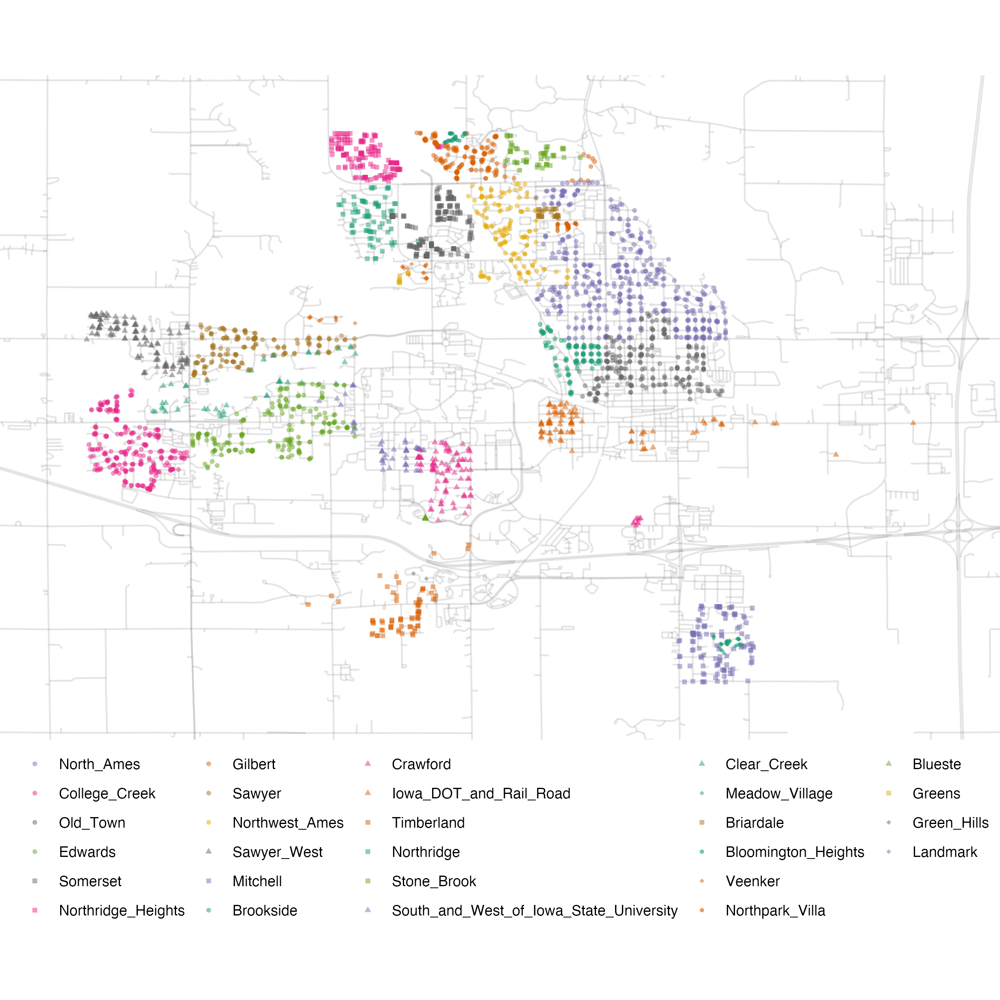
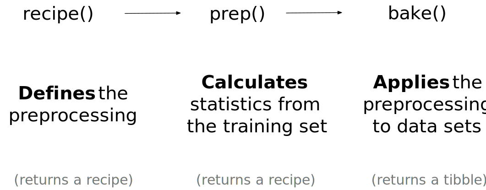

---
output_yaml:
  - _output.yml
---

<!-- 1) bake(..., newdata = NULL) fails in several places. Are they using an old version of make? -->

<!-- 2) Each section ends with the code we have done. That seems redundant and confusing. -->

<!-- 3) Need to make the approach here mesh with the approaches used in chapter 11 and 12. What can we cut from here that is not used? How should we change later chapters to be consistent with this modern approach? -->

<!-- 4) I am concerned about the ames_snippets.R code used in the original but, maybe, not needed here. -->

<!-- 5) I totally skipped the workflow chapter (8) in the original. Is that OK? -->

<!-- 6) Many sections begun with a weird code chunk. These should be cleaned up and organized. -->

<!-- 7) Deal with the missing references. Need to add them to the bib. -->

<!-- 8) Maybe follow their example with r pkg(dplyr) instead of **dplyr**. -->

# Model Choice

Still a draft. Come back in a few weeks.

## The Ames housing data {#ames}

```{r, echo = FALSE, message = FALSE}
data(ames, package = "modeldata")
library(tidyverse)
library(tidymodels)
```


The Ames housing data set is an excellent resource for learning about models that we will use throughout this book. It contains data on `r format(nrow(ames), big.mark = ",")` properties in Ames, Iowa, including columns related to 

 * house characteristics (bedrooms, garage, fireplace, pool, porch, etc.),
 * location (neighborhood),
 * lot information (zoning, shape, size, etc.),
 * ratings of condition and quality, and
 * sale price.


We use a transformed version available in the **modeldata** package. This version has several changes and improvements to the data. For example, the longitude and latitude values have been determined for each property. Also, some columns were modified to be more analysis ready. For example: 

 * In the raw data, if a house did not have a particular feature, it was implicitly encoded as missing. For example, there were `r format(sum(ames$Alley == "No_Alley_Access"), big.mark = ",")` properties that did not have an alleyway. Instead of leaving these as missing, they were relabeled in the transformed version to indicate that no alley was available.

 * The categorical predictors were converted to R's factor data type. While both the tidyverse and base R have moved away from importing data as factors by default, this data type is a better approach for storing qualitative data for _modeling_ than simple strings.  
 
 * We removed a set of quality descriptors for each house since they are more like outcomes than predictors.

To load the data: 

```{r ames-load, warning = FALSE, message = FALSE}
library(modeldata) # This is also loaded by the tidymodels package
data(ames)

# or, in one line:
data(ames, package = "modeldata")

dim(ames)
```

### Exploring important features

It makes sense to start with the outcome we want to predict: the last sale price of the house (in USD): 

```{r}
ggplot(ames, aes(x = Sale_Price)) + 
  geom_histogram(bins = 50)
```

The data are right-skewed; there are more inexpensive houses than expensive ones. The median sale price was \$`r format(median(ames$Sale_Price), big.mark = ",")` and the most expensive house was \$`r format(max(ames$Sale_Price), big.mark = ",")`. When modeling this outcome, a strong argument can be made that the price should be log-transformed. The advantages of doing this are that no houses would be predicted with negative sale prices and that errors in predicting expensive houses will not have an undue influence on the model. Also, from a statistical perspective, a logarithmic transform may also _stabilize the variance_ in a way that makes inference more legitimate. Let's visualize the transformed data:

```{r}
ggplot(ames, aes(x = Sale_Price)) + 
  geom_histogram(bins = 50) +
  scale_x_log10()
```

While not perfect, this will probably result in better models than using the untransformed data. 


The units of the model coefficients might be more difficult to interpret, as will measures of performance. For example, the root mean squared error (RMSE) is a common performance metric that is used in regression models. It uses the difference between the observed and predicted values in its calculations. If the sale price is on the log scale, these differences (i.e. the residuals) are also in log units. For this reason, it can be difficult to understand the quality of a model whose RMSE is 0.15 log units. 

Despite these drawbacks, the models used in this book utilize the log transformation for this outcome. _From this point on_, the outcome column is pre-logged in the `ames` data frame: 

```{r}
ames <- ames %>% 
  mutate(Sale_Price = log10(Sale_Price))
```

Another important aspect of these data for our modeling are their geographic locations. This spatial information is contained in the data in two ways: a qualitative `Neighborhood` label as well as quantitative longitude and latitude data. To visualize the spatial information, let's use both together to plot the data on a map and color by neighborhood: 

```{r, echo = FALSE}

```

We can see a few noticeable patterns. First, there is a void of data points in the center of Ames. This corresponds to Iowa State University. Second, while there are a number of neighborhoods that are geographically isolated, there are others that are adjacent to each other. For example, Timberland is located apart from almost all other neighborhoods:

```{r, echo = FALSE}
knitr::include_graphics("10-model-choice/images/timberland.png")
```

The Meadow Village neighborhood in Southwest Ames is like an island of properties ensconced inside the sea of properties that make up the Mitchell neighborhood: 

```{r, echo = FALSE}
knitr::include_graphics("10-model-choice/images/mitchell.png")
```
 
A detailed inspection of the map also shows that the neighborhood labels are not completely reliable. For example, there are some properties labeled as being in Northridge that are surrounded by houses in the adjacent Somerset neighborhood: 

```{r, echo = FALSE}
knitr::include_graphics("10-model-choice/images/northridge.png")
```

Also, there are ten isolated houses labeled as being in Crawford but are not close to the majority of the other houses in that neighborhood:

```{r, echo = FALSE}
knitr::include_graphics("10-model-choice/images/crawford.png")
```

Also notable is the "Iowa Department of Transportation (DOT) and Rail Road" neighborhood adjacent to the main road on the east side of Ames. There are several clusters of houses within this neighborhood as well as some longitudinal outliers; the two houses furthest east are isolated from the other locations. 

```{r, echo = FALSE}
knitr::include_graphics("10-model-choice/images/dot_rr.png")
```

It is critical to conduct _exploratory data analysis_ prior to beginning any modeling. These housing data have characteristics that present interesting challenges about how the data should be processed and modeled. We describe many of these in later chapters. Some basic questions that could be examined include: 

 * Are there any odd or noticeable things about the distributions of the individual predictors? Is there much skewness or any pathological distributions? 

 * Are there high correlations between predictors? For example, there are multiple predictors related to the size of the house. Are some redundant?

 * Are there associations between predictors and the outcomes? 

Many of these questions will be revisited as these data are used in upcoming examples.The important code that we will carry forward is:
 
 
```{r, eval = FALSE}
library(tidymodels)
data(ames)
ames <- ames %>% 
  mutate(Sale_Price = log10(Sale_Price))
``` 

## Spending our data {#splitting}

There are several steps to create a useful model, including parameter estimation, model selection and tuning, and performance assessment. At the start of a new project, there is usually an initial finite pool of data available for all these tasks. How should the data be applied to these steps? The idea of _data spending_ is an important first consideration when modeling, especially as it relates to empirical validation. 

When there are copious amounts of data available, a smart strategy is to allocate specific subsets of data for different tasks, as opposed to allocating the largest possible amount to the model parameter estimation only. There may be questions about many modeling project steps that must be answered with limited prior knowledge. For example, one possible strategy (when both data and predictors are abundant) is to spend a specific subset of data to determine which predictors are informative, before considering parameter estimation at all. 

If the initial pool of data available is not huge, there will be some overlap of how and when our data is "spent" or allocated, and a solid methodology for data spending is important. Here, we demonstrate the basics of _splitting_ our initial pool of samples for different purposes. 

### Common methods for splitting data {#splitting-methods}

The primary approach for empirical model validation is to split the existing pool of data into two distinct sets. Some observations are used to develop and optimize the model. This _training set_ is usually the majority of the data. These data are a sandbox for model building where different models can be fit, feature engineering strategies are investigated, and so on. We as modeling practitioners spend the vast majority of the modeling process using the training set as the substrate to develop the model.  

The other portion of the observations are placed into the _test set_. This is held in reserve until one or two models are chosen as the methods that are mostly likely to succeed. The test set is then used as the final arbiter to determine the efficacy of the model. It is critical to only look at the test set once; otherwise, it becomes part of the modeling process. 


Suppose we allocate 80% of the data to the training set and the remaining 20% for testing.  The most common method is to use simple random sampling. The **rsample** package has tools for making data splits such as this; the function `intial_split()` was created for this purpose. It takes the data frame as an argument as well as the proportion to be placed into training. Using the previous data frame produced by the code snippet from the summary in Section \@ref(ames-summary): 

```{r, message = FALSE, warning = FALSE}
# Set the random number stream using `set.seed()` so that the results can be 
# reproduced later. 
set.seed(123)

# Save the split information for an 80/20 split of the data
ames_split <- initial_split(ames, prob = 0.80)
ames_split
```

The printed information denotes the amount of data in the training set ($n = `r format(nrow(training(ames_split)), big.mark = ",")`$), the amount in the test set ($n = `r format(nrow(testing(ames_split)), big.mark = ",")`$), and the size of the original pool of samples  ($n = `r format(nrow(ames), big.mark = ",")`$). 

The object `ames_split` is an `rsplit` object and only contains the partitioning information; to get the resulting data sets, we apply two more functions:

```{r}
ames_train <- training(ames_split)
ames_test  <-  testing(ames_split)

dim(ames_train)
```

These objects are data frames with the same _columns_ as the original data but only the appropriate _rows_ for each set. 

Simple random sampling is appropriate in many cases but there are exceptions. When there is a dramatic _class imbalance_ in classification problems, one class occurs much less frequently than another. Using a simple random sample may haphazardly allocate these infrequent samples disproportionately into the training or test set. To avoid this, _stratified sampling_ can be used. The training/test split is conducted separately within each class and then these subsamples are combined into the overall training and test set. For regression problems, the outcome data can be artificially binned into _quartiles_ and then stratified sampling conducted four separate times. This is an effective method for keeping the distributions of the outcome similar between the training and test set. 

```{r, echo = FALSE, fig.cap = "The distribution of the sale price (in log units) for the Ames housing data. The vertical lines indicate the quartiles of the data."}

sale_dens <- 
  density(ames$Sale_Price, n = 2^10) %>% 
  tidy() 

quartiles <- quantile(ames$Sale_Price, probs = c(1:3)/4)
quartiles <- tibble(prob = (1:3/4), value = unname(quartiles))
quartiles$y <- approx(sale_dens$x, sale_dens$y, xout = quartiles$value)$y

quart_plot <-
  ggplot(ames, aes(x = Sale_Price)) +
  geom_line(stat = "density") +
  geom_segment(data = quartiles,
               aes(x = value, xend = value, y = 0, yend = y),
               lty = 2) +
  xlab("Sale Price (log-10 USD)")
quart_plot
```

Consider the distribution of the sale price outcome for the Ames housing data. As previously discussed, the sale price distribution is right-skewed, with proportionally more expensive houses than inexpensive houses on either side of the center of the distribution. The worry here is that the more expensive houses would not be represented in the training set well with simple splitting; this would increase the risk that our model would be ineffective at predicting the price for such properties.  The dotted vertical lines indicate the four quartiles for these data. A stratified random sample would conduct the 80/20 split within each of these data subsets and then pool the results together. In **rsample**, this is achieved using the `strata` argument: 

<!-- DK: Cut this strata stuff? -->

```{r}
set.seed(123)
ames_split <- initial_split(ames, prob = 0.80, strata = Sale_Price)
ames_train <- training(ames_split)
ames_test  <-  testing(ames_split)

dim(ames_train)
```

Only a single column can be used for stratification. 

Are there situations when random sampling is not the best choice? One case is when the data have a significant _time_ component, such as time series data. Here, it is more common to use the most recent data as the test set. The **rsample** package contains a function called `initial_time_split()` that is very similar to `initial_split()`. Instead of using random sampling, the `prop` argument denotes what proportion of the first part of the data should be used as the training set; the function assumes that the data have been pre-sorted in an appropriate order. 

### What proportion should be used? 

The amount of data that should be allocated when splitting the data is highly dependent on the context of the problem at hand. Too much data in the training set lowers the quality of the performance estimates. Conversely, too much data in the test set handicaps the model's ability to find appropriate parameter estimates. There are parts of the statistics community that eschew test sets in general because they believe all of the data should be used for parameter estimation. While there is merit to this argument, it is good modeling practice to have an unbiased set of observations as the final arbiter of model quality. A test set should be avoided only when the data are pathologically small.

### What about a validation set? 

Previously, when describing the goals of data splitting, we singled out the test set as the data that should be used to conduct a proper evaluation of model performance on the final model(s). This begs the question of, "How can we tell what is best if we don't measure performance until the test set?" 

It is common to hear about _validation sets_ as an answer to this question, especially in the neural network and deep learning literature. The validation set was originally defined in the early days of neural networks when researchers realized that measuring performance by re-predicting the training set samples led to results that were overly optimistic (significantly, unrealistically so). This led to models that overfit, meaning that they performed very well on the training set but poorly on the test set. To combat this issue, a small validation set of data were held back and used to measure performance as the network was trained. Once the validation set error rate began to rise, the training would be halted. In other words, the validation set was a means to get a rough sense of how well the model performed prior to the test set. It is largely semantics as to whether validation sets are a subset of the training set or a third allocation in the initial split of the data.


### Other considerations 

Throughout this book, notice which data are exposed to the model at any given time. Remember that it is critical to quarantine the test set from any model building activities.  The problem of _information leakage_ occurs when data outside of the training set are used in the modeling process. 


For example, in a machine learning competition, the test set data might be provided without the true outcome values so that the model can be scored and ranked. One potential method for improving the score might be to fit the model using the training set points that are most similar to the test set values. While the test set isn't directly used to fit the model, it still has a heavy influence. In general, this technique is highly problematic since it reduces the _generalization error_ of the model to optimize performance on a specific data set. There are more subtle ways that the test set data can be utilized during training. Keeping the training data in a separate data frame from the test set is a one small check to make sure that information leakage does not occur by accident. 

We will discuss techniques to subsample the training set to mitigate specific issues (e.g., class imbalances). This is a valid and common technique that deliberately results in the training set data diverging from the population from which the data were drawn. It is critical that the test set continue to mirror what the model would encounter _in the wild_. In other words, the test set should always resemble new data that will be given to the model. 


Data splitting is the fundamental tool for empirical validation for models. Even in the era of unrestrained data collection, a typical modeling project has a limited amount of appropriate data and wise "spending" of a project's data is necessary. In this chapter, we discussed several strategies for partitioning the data into distinct groups for modeling and evaluation. 

At this checkpoint, the important code snippets are:

```{r, eval = FALSE}
library(tidymodels)
data(ames)
ames <- ames %>% mutate(Sale_Price = log10(Sale_Price))

set.seed(123)
ames_split <- initial_split(ames, prob = 0.80, strata = Sale_Price)
ames_train <- training(ames_split)
ames_test  <-  testing(ames_split)
```


```{r, include = FALSE}
val_list <- function(x) {
  x <- format(table(x), big.mark = ",")
  x <- paste0("`", names(x), "` ($n = ", unname(x), "$)")
  knitr::combine_words(x)
}

```

## Feature engineering with recipes {#recipes}

Feature engineering encompasses activities that reformat predictor values to make them easier for a model to use effectively. This includes transformations and encodings of the data to best represent their important characteristics. Imagine that you have two predictors in a data set that can be more effectively represented in your model of interest as a ratio; creating a new predictor from the ratio of the original two is a simple example of feature engineering. 

Take the location of a house in Ames as a more involved example. There are a variety of ways that this spatial information can be exposed to a model, including neighborhood (a qualitative measure), longitude/latitude, distance to the nearest school or Iowa State University, and so on. When choosing how to encode these data in modeling, we might choose an option we believe most associated with the outcome. The original format of the data (e.g., numeric like distance versus categorical like neighborhood) is also a driving factor in feature engineering choices. 

There are many other examples of preprocessing to build better features for modeling: 

 * Correlation between predictors can be reduced via feature extraction or the removal of some predictors. 
 
 * When some predictors have missing values, they can be imputed using a sub-model.
 
 * Models that use variance-type measures may benefit from coercing the distribution of some skewed predictors to be symmetric by estimating a transformation. 

Feature engineering and data preprocessing can also involve reformatting _required_ by the model. Some models use geometric distance metrics and, consequently, numeric predictors should be centered and scaled so that they are all in the same units. Otherwise, the distance values would be biased by the scale of each column. 


The **recipes** package combines different feature engineering and preprocessing tasks into a single object and then apply these transformations to different data sets. 

### A simple recipe for the Ames housing data 

In this section, we will focus on a small subset of the predictors available in the Ames housing data: 

 * The neighborhood (qualitative, with `r length(levels(ames_train$Neighborhood))` neighborhoods in the training set)

 * The general living area (continuous, named `Gr_Liv_Area`)

 * The year built (`Year_Built`)

 * The type of building (`Bldg_Type` with values `r val_list(ames_train$Bldg_Type)`)

Suppose that an initial ordinary linear regression model were fit to these data. Recalling that, in Chapter \@ref(ames), the sale prices were pre-logged, a standard call to `lm()`, a function similar to `stan_glm()`, might look like:

```{r, eval = FALSE}
lm(Sale_Price ~ Neighborhood + log10(Gr_Liv_Area) + Year_Built + Bldg_Type)
```

When this function is executed, the data are converted from a data frame to a numeric _design matrix_ (also called a _model matrix_) and then the least squares method is used to estimate parameters.  What the formula above does can be decomposed into a series of _steps_:

1. Sale price is defined as the outcome while neighborhood, general living area, the year built, and building type variables are all defined as predictors. 

1. A log transformation is applied to the general living area predictor. 

1. The neighborhood and building type columns are converted from a non-numeric format to a numeric format (since least squares requires numeric predictors). 

The formula method will apply these data manipulations to any data, including new data, that are passed to the `predict()` function. 

A recipe is also an object that defines a series of steps for data processing. Unlike the formula method inside a modeling function, the recipe defines the steps without immediately executing them; it is only a specification of what _should_ be done. Here is a recipe equivalent to the formula above that builds on the code summary in Section \@ref(splitting-summary):

```{r}
library(tidymodels) # Includes the recipes package

simple_ames <- 
  recipe(Sale_Price ~ Neighborhood + Gr_Liv_Area + Year_Built + Bldg_Type,
         data = ames_train) %>%
  step_log(Gr_Liv_Area, base = 10) %>% 
  step_dummy(all_nominal())
simple_ames
```

Let's break this down: 

1. The call to `recipe()` with a formula tells the recipe the _roles_ of the variables (e.g., predictor, outcome). It only uses the data to determine the data types for the columns. 

1. `step_log()` declares that `Gr_Liv_Area` should be log transformed. 

1. `step_dummy()` is used to specify which variables should be converted from a qualitative format to a quantitative format, in this case, using dummy or indicator variables. An indicator or dummy variable is a binary numeric variable (a column of ones and zeroes) that encodes qualitative information; we will dig deeper into these kinds of variables in Section \@ref(dummies). 

The function `all_nominal()` captures the names of any columns that are currently factor or character (i.e., nominal) in nature. This is a **dplyr** selector function similar to `starts_with()` or `matches()` but can only be used inside of a recipe. 


What is the advantage to using a recipe? There are a few, including:

 * These computations can be recycled across models since they are not tightly coupled to the modeling function. 
 
 * A recipe enables a broader set of data processing choices than formulas can offer. 
 
 * The syntax can be very compact. For example, `all_nominal()` can be used to capture many variables for specific types of processing while a formula would require each to be explicitly listed. 
 
 * All data processing can be captured in a single R object instead of in scripts that are repeated, or even spread across different files.  
 
### Using recipes
 
Remember that when invoking the `recipe()` function, the steps are not estimated or executed in any way. The second phase for using a recipe is to estimate any quantities required by the steps using the `prep()` function. For example, we can use `step_normalize()` to center and scale any predictors selected in the step. When we call `prep(recipe, training)`, this function estimates the required means and standard deviations from the data in the `training` argument. The transformations specified by each step are also sequentially executed on the data set. Again using normalization as the example, the means and variances are estimated and then used to standardize the columns. 


For our example recipe, we can now `prep()`: 

```{r}
simple_ames <- prep(simple_ames, training = ames_train)
simple_ames
``` 

Note that, after preparing the recipe, the print statement shows the results of the selectors (e.g., `Neighborhood` and `Bldg_Type` are listed instead of `all_nominal`). 

One important argument to `prep()` is `retain`. When `TRUE` (the default), the prepared version of the training set is kept within the recipe. This data set has been pre-processed using all of the steps listed in the recipe. Since `prep()` has to execute the recipe as it proceeds, it may be advantageous to keep this version of the training set so that, if that data set is to be used later, redundant calculations can be avoided. However, if the training set is big, it may be problematic to keep such a large amount of data in memory. Use `retain = FALSE` to avoid this. 

The third phase of recipe usage is to apply the preprocessing operations to a data set using the `bake()` function. The `bake()` function can apply the recipe to _any_ data set. To use the test set, the syntax would be:

<!--DK: Fix the NULL problem!-->

```{r, eval=FALSE}
test_ex <- bake(simple_ames, new_data = ames_test)
names(test_ex) %>% 
  head()
```

Note the dummy variable columns starting with `Neighborhood_`. The `bake()` function can also take selectors so that, if we only wanted the neighborhood results, we could use:

```{r, eval = FALSE}
bake(simple_ames, ames_test, starts_with("Neighborhood_"))
```

To get the processed version of the training set, we could use `bake()` and pass in the argument `ames_train` but, as previously mentioned, this would repeat calculations that have already been executed. Instead, we can use `new_data = NULL` to quickly return the training set (if `retain = TRUE` was used). It accesses the data component of the prepared recipe. 

<!-- DK: Why doesn't this work? NULL seems unacceptable. -->

```{r, eval = FALSE}
bake(simple_ames, new_data = NULL) %>% 
  nrow()

ames_train %>% 
  nrow()
```

To reiterate, using a recipe is a three phase process summarized as:

```{r, echo = FALSE}

```


### Encoding qualitative data in a numeric format  {#dummies}

One of the most common feature engineering tasks is transforming nominal or qualitative data (factors or characters) so that they can be encoded or represented numerically. Sometimes we can alter the factor levels of a qualitative column in helpful ways _prior_ to such a transformation. For example, `step_unknown()` can be used to change missing values to a dedicated factor level. Similarly, if we anticipate that a new factor level may be encountered in future data, `step_novel()` can allot a new level for this purpose. 

Additionally, `step_other()` can be used to analyze the frequencies of the factor levels in the training set and convert infrequently occurring values to a catch-all level of "other", with a specific threshold that can be specified. A good example is the `Neighborhood` predictor in our data:

```{r}
ggplot(ames_train, aes(y = Neighborhood)) + 
  geom_bar() + 
  labs(y = NULL)
```

Here there are two neighborhoods that have less than five properties in the training data; in this case, no houses at all in the Landmark neighborhood were included in the training set. For some models, it may be problematic to have dummy variables with a single non-zero entry in the column. At a minimum, it is highly improbable that these features would be important to a model. If we add `step_other(Neighborhood, threshold = 0.01)` to our recipe, the bottom 1% of the neighborhoods will be lumped into a new level called "other". In this training set, this will catch `r sum(table(ames_train$Neighborhood)/nrow(ames_train) <= .01)` neighborhoods.  

For the Ames data, we can amend the recipe to use:

```{r}
simple_ames <- 
  recipe(Sale_Price ~ Neighborhood + Gr_Liv_Area + Year_Built + Bldg_Type,
         data = ames_train) %>%
  step_log(Gr_Liv_Area, base = 10) %>% 
  step_other(Neighborhood, threshold = 0.01) %>% 
  step_dummy(all_nominal())
```


There are a few strategies for converting a factor predictor to a numeric format. The most common method is to create "dummy" or indicator variables. Let's take the predictor in the Ames data for the building type, which is a factor variable with five levels. For dummy variables, the single `Bldg_Type` column would be replaced with four numeric columns whose values are either zero or one. These binary variables represent specific factor level values. In R, the convention is to _exclude_ a column for the first factor level (`OneFam`, in this case). The `Bldg_Type` column would be replaced with a column called `TwoFmCon` that is one when the row has that value and zero otherwise. Three other columns are similarly created: 

```{r, echo = FALSE}
show_rows <- 
  ames_train %>% 
  mutate(.row = row_number()) %>% 
  group_by(Bldg_Type) %>% dplyr::select(Bldg_Type, .row) %>% 
  slice(1) %>% 
  pull(.row)

recipe(~Bldg_Type, data = ames_train) %>% 
  step_mutate(`Raw Data` = Bldg_Type) %>% 
  step_dummy(Bldg_Type, 
             naming = function(var, lvl, ordinal = FALSE, sep = "_") lvl) %>% 
  prep() %>% 
  bake(ames_train) %>% 
  slice(show_rows) %>% 
  arrange(`Raw Data`)
```


Why not all five? The most basic reason is simplicity; if you know the value for these four columns, you can determine the last value because these are mutually exclusive categories. More technically, the classical justification is that a number of models, including ordinary linear regression, have numerical issues when there are linear dependencies between columns. If all five building type indicator columns are included, they would add up to the intercept column (if there is one). This would cause an issue, or perhaps an outright error, in the underlying matrix algebra.  

The full set of encodings can be used for some models. This is traditionally called the "one-hot" encoding and can be achieved using the `one_hot` argument of `step_dummy()`. 

One helpful feature of `step_dummy()` is that there is more control over how the resulting dummy variables are named. In base R, dummy variable names mash the variable name with the level, resulting in names like `NeighborhoodVeenker`. Recipes, by default, use an underscore as the separator between the name and level (e.g., `Neighborhood_Veenker`) and there is an option to use custom formatting for the names. The default naming convention in recipes makes it easier to capture those new columns in future steps using a selector, such as `starts_with("Neighborhood_")`. 

Traditional dummy variables require that all of the possible categories be known to create a full set of numeric features. There are other methods for doing this transformation to a numeric format. _Feature hashing_ methods only consider the value of the category to assign it to a predefined pool of dummy variables. This can be a good strategy when there are a large number of possible categories, but the statistical properties may not be optimal. For example, it may unnecessarily _alias_ categories together (by assigning them to the same dummy variable). This reduces the specificity of the encoding and, if that dummy variable were important, it would be difficult to determine which of the categories is driving the effect. 

Another method that is useful when there are a large number of categories is called _effect_ or _likelihood encodings_. This method replaces the original data with a single numeric column that measures the _effect_ of those data. For example, for the neighborhood predictor, the mean sale price is computed for each neighborhood and these means are substituted for the original data values. This can be effective but should be used with care. In effect, a mini-model is being added to the actual model and this can lead to over-fitting. To be cautious, this type of encoding should be rigorously resampled. Within a recipe, the **embed** package has several step functions, such as `step_lencode_mixed()`, for effect encodings. Both feature hashing and effect encoding methods can also seamlessly handle situations where a novel factor level is encountered in the data. 


Different recipe steps can have different effects on columns of the data. For example, `step_log()` modifies a column in-place without changing the name. Other steps, such as `step_dummy()` eliminate the original data column and replace it with one or more columns with different names. This behavior depends on the type of operation being done. 


### Interaction terms

Interaction effects involve two or more predictors. Such an effect occurs when one predictor has an effect on the outcome that is contingent on one or more other predictors. For example, if you were trying to predict your morning commute time, two potential predictors could be the amount of traffic and the time of day. However, the relationship between commute time and the amount of traffic is different for different times of day. In this case, you could add an interaction term between the two predictors to the model along with the original two predictors (which are called the "main effects"). Numerically, an interaction term between predictors is encoded as their product. Interactions are only defined in terms of their effect on the outcome and can be combinations of different types of data (e.g., numeric, categorical, etc). 

After exploring the Ames training set, we might find that the regression slopes for the general living area differ for different building types: 

```{r}
ggplot(ames_train, aes(x = Gr_Liv_Area, y = 10^Sale_Price)) + 
  geom_point(alpha = .2) + 
  facet_wrap(~ Bldg_Type) + 
  geom_smooth(method = lm, formula = y ~ x, se = FALSE, col = "red") + 
  scale_x_log10() + 
  scale_y_log10() + 
  labs(x = "General Living Area", y = "Sale Price (USD)")
```

How are interactions specified? Recipes are explicit and sequential. With the current recipe, `step_dummy()` has already created dummy variables. How would we combine these for an interaction? The additional step would look like `step_interact(~ interaction terms)` where the terms on the right-hand side of the tilde are the interactions. These can include selectors, so it would be appropriate to use:

```{r}
simple_ames <- 
  recipe(Sale_Price ~ Neighborhood + Gr_Liv_Area + Year_Built + Bldg_Type,
         data = ames_train) %>%
  step_log(Gr_Liv_Area, base = 10) %>% 
  step_other(Neighborhood, threshold = 0.01) %>% 
  step_dummy(all_nominal()) %>% 
  # Gr_Liv_Area is on the log scale from a previous step
  step_interact( ~ Gr_Liv_Area:starts_with("Bldg_Type_") )
```

Additional interactions can be specified in this formula by separating them by `+`. Also note that the recipe will only utilize interactions between different variables; if the formula uses `var_1:var_1`, this term will be ignored. 


### Skipping steps for new data {#skip-equals-true}

The sale price data are already log transformed in the `ames` data frame. Why not use:

```r
 step_log(Sale_Price, base = 10)
```

This will cause a failure when the recipe is applied to new properties when the sale price is not known. Since price is what we are trying to predict, there probably won't be a column in the data for this variable. In fact, to avoid _information leakage_, many tidymodels packages isolate the data being used when making any predictions. This means that the training set and any outcome columns are not available for use at prediction time. 


However, there are other circumstances where this is not an adequate solution. For example, in classification models where there is a severe class imbalance, it is common to conduct _subsampling_ of the data that are given to the modeling function. For example, suppose that there were two classes and a 10% event rate. A simple, albeit controversial, approach would be to _down-sample_ the data so that the model is provided with all of the events and a random 10% of the non-event samples. 

The problem is that the same subsampling process **should not be applied** to the data being predicted. As a result, when using a recipe, we need a mechanism to ensure that some operations are only applied to the data that are given to the model. Each step function has an option called `skip` that, when set to `TRUE`, will be ignored by the `bake()` function used with a data set argument. In this way, you can isolate the steps that affect the modeling data without causing errors when applied to new samples. However, all steps are applied when using `bake(new_data = NULL)`. 

### Spline functions {-}

When a predictor has a nonlinear relationship with the outcome, some types of predictive models can adaptively approximate this relationship during training. However, simpler is usually better and it is not uncommon to try to use a simple model, such as a linear fit, and add in specific non-linear features for predictors that may need them. One common method for doing this is to use _spline_ functions to represent the data. Splines replace the existing numeric predictor with a set of columns that allow a model to emulate a flexible, non-linear relationship. As more spline terms are added to the data, the capacity to non-linearly represent the relationship increases. Unfortunately, it may also increase the likelihood of picking up on data trends that occur by chance (i.e., over-fitting). 

If you have ever used `geom_smooth()` within a `ggplot`, you have probably used a spline representation of the data. For example, each panel below uses a different number of smooth splines for the latitude predictor:

```{r}
library(patchwork)
library(splines)

plot_smoother <- function(deg_free) {
  ggplot(ames_train, aes(x = Latitude, y = Sale_Price)) + 
    geom_point(alpha = .2) + 
    scale_y_log10() +
    geom_smooth(
      method = lm,
      formula = y ~ ns(x, df = deg_free),
      col = "red",
      se = FALSE
    ) +
    ggtitle(paste(deg_free, "Spline Terms"))
}

( plot_smoother(2) + plot_smoother(5) ) / ( plot_smoother(20) + plot_smoother(100) )
```

The `ns()` function in the **splines** package generates feature columns using functions called _natural splines_.

Some panels clearly fit poorly; two terms _under-fit_ the data while 100 terms _over-fit_. The panels with five and 20 terms seem like reasonably smooth fits that catch the main patterns of the data. This indicates that the proper amount of "non-linear-ness" matters. The number of spline terms could then be considered a _tuning parameter_ for this model. 

In **recipes**, there are multiple steps that can create these types of terms. To add a natural spline representation for this predictor:

```{r, eval = FALSE}
recipe(Sale_Price ~ Neighborhood + Gr_Liv_Area + Year_Built + Bldg_Type + Latitude,
         data = ames_train) %>%
  step_log(Gr_Liv_Area, base = 10) %>% 
  step_other(Neighborhood, threshold = 0.01) %>% 
  step_dummy(all_nominal()) %>% 
  step_interact( ~ Gr_Liv_Area:starts_with("Bldg_Type_") ) %>% 
  step_ns(Latitude, deg_free = 20)
```

The user would need to determine if both neighborhood and latitude should be in the model since they both represent the same underlying data in different ways.


### How data are used by the recipe

Data are given to recipes at different stages. When calling `recipe(..., data)`, the data set is used to determine the data types of each column so that selectors such as `all_numeric()` can be used. When preparing the data using `prep(recipe, training)`, the data in `training` are used for all estimation operations, from determining factor levels to computing PCA components and everything in between. It is important to realize that all preprocessing and feature engineering steps only utilize the training data. Otherwise, information leakage can negatively impact the model. 

When using `bake(recipe, new_data)`, no quantities are re-estimated using the values in `new_data`. Take centering and scaling using `step_normalize()` as an example. Using this step, the means and standard deviations from the appropriate columns are determined from the training set; new samples are standardized using these values when `bake()` is invoked. 

### Using a recipe with traditional modeling functions {#recipes-manual}

Previously, we introduced high-level interfaces that take a recipe as an input argument and automatically handle the `prep()`/`bake()` process of preparing data for modeling. However, recipes can be used with traditional R modeling functions as well; this section shows how to use a recipe outside those high-level interfaces.

Let's use a slightly augmented version of the last recipe, now including longitude:

```{r}
ames_rec <- 
  recipe(Sale_Price ~ Neighborhood + Gr_Liv_Area + Year_Built + Bldg_Type + 
           Latitude + Longitude, data = ames_train) %>%
  step_log(Gr_Liv_Area, base = 10) %>% 
  step_other(Neighborhood, threshold = 0.01) %>% 
  step_dummy(all_nominal()) %>% 
  step_interact( ~ Gr_Liv_Area:starts_with("Bldg_Type_") ) %>% 
  step_ns(Latitude, Longitude, deg_free = 20)
```

To get the recipe ready, we prepare it, and then extract the training set using `bake()` with `new_data = NULL`. When calling `prep()`, if the `training` argument is not given, it uses the data that was initially given to the `recipe()` function call.

<!-- DK: Third NULL error. -->

```{r}
ames_rec_prepped <- prep(ames_rec)
# ames_train_prepped <- bake(ames_rec_prepped, new_data = NULL)
ames_test_prepped <- bake(ames_rec_prepped, ames_test)

# Fit the model; Note that the column Sale_Price has already been
# log transformed.

# lm_fit <- lm(Sale_Price ~ ., data = ames_train_prepped)
```

The **broom** package has methods that make it easier to work with model objects. First, `broom::glance()` shows a succinct summary of the model in a handy tibble format:

```{r}
# glance(lm_fit)
```

The model coefficients can be extracted using the `tidy()` method:

```{r}
# tidy(lm_fit)
```

To make predictions on the test set, we use the standard syntax:

```{r}
# predict(lm_fit, ames_test_prepped %>% 
#           head())
```

### Tidy a recipe

There is also a `tidy()` method for recipes. Calling it with no other arguments gives a summary of the recipe steps:

```{r}
tidy(ames_rec_prepped)
```

We can specify the `id` field in a step function call but otherwise it is generated using a random suffix. This field can be helpful if the same type of step is added to the recipe more than once. Let's specify the `id` ahead of time for `step_log()`, since we want to `tidy()` it:

```{r}
ames_rec <- 
  recipe(Sale_Price ~ Neighborhood + Gr_Liv_Area + Year_Built + Bldg_Type + 
           Latitude + Longitude, data = ames_train) %>%
  step_log(Gr_Liv_Area, base = 10, id = "my_id") %>% 
  step_other(Neighborhood, threshold = 0.01) %>% 
  step_dummy(all_nominal()) %>% 
  step_interact( ~ Gr_Liv_Area:starts_with("Bldg_Type_") ) %>% 
  step_ns(Latitude, Longitude, deg_free = 20)

ames_rec_prepped <- prep(ames_rec)
```

The `tidy()` method can be called again along with the `id` identifier we specified to get these results:

```{r}
tidy(ames_rec_prepped, id = "my_id")
```

The `tidy()` method can be called with the `number` identifier as well, if we know which step in the recipe we need:

```{r}
tidy(ames_rec_prepped, number = 2)
```

Each `tidy()` method returns the relevant information about that step. For example, the `tidy()` method for `step_dummy()` returns a column with the variables that were converted to dummy variables and another column with all of the known levels for each column. 

### Column roles

When a formula is used with the initial call to `recipes()` it assigns _roles_ to each of the column depending on which side of the tilde that they are on. Those roles are either `"predictor"` or `"outcome"`. However, other roles can be assigned as needed. 

For example, in our Ames data set, the original raw data contained a field for address. It may be useful to keep that column in the data so that, after predictions are made, problematic results can be investigated in detail. In other words, the column is important but isn't a predictor or outcome. 

To solve this, the `add_role()`, `remove_role()`, and `update_role()` functions can be helpful. For example, for the house price data, the street address column could be modified using

```r
ames_rec %>% update_role(address, new_role = "street address")
```

Any character string can be used as a role. Also, columns can have multiple roles so that they can be selected under more than one context. 

This can be helpful when the data are _resampled_. It helps to keep the columns that are _not_ involved with the model fit in the same data frame (rather than in an external vector). Resampling creates alternate versions of the data mostly by row subsampling. If the street address were in another column, additional subsampling would be required and might lead to more complex code and a higher likelihood of errors. 

Finally, all step functions have a `role` field that can assign roles to the results of the step. In many cases, columns affected by a step retain their existing role. For example, the `step_log()` calls to the `ames_rec` object above affected the `Gr_Liv_Area` column. For that step, the default behavior is to keep the existing role for this column since no new column is created. As a counter-example, the step to produce splines defaults new columns to have a role of `"predictor"` since that is usually how spline columns are used in a model. Most steps have sensible defaults but, since the defaults can be different, be sure to check the documentation page to understand what which role(s) will be assigned. 

You have learned about using recipes for flexible feature engineering and data preprocessing, from creating dummy variables to handling class imbalance and more. Feature engineering is an important part of the modeling process where information leakage can easily occur and good practices must be adopted. Between the **recipes** package and other packages that extend recipes, there are over 100 available steps. All possible recipe steps are enumerated at [`tidymodels.org/find`](https://www.tidymodels.org/find/). The recipes framework provides a rich data manipulation environment for preprocessing and transforming data prior to modeling. 
Additionally, [`tidymodels.org/learn/develop/recipes/`](https://www.tidymodels.org/learn/develop/recipes/) shows how custom steps can be created.

The code that we will use in later is:

```{r, eval = FALSE}
library(tidymodels)
data(ames)
ames <- mutate(ames, Sale_Price = log10(Sale_Price))

set.seed(123)
ames_split <- initial_split(ames, prob = 0.80, strata = Sale_Price)
ames_train <- training(ames_split)
ames_test  <-  testing(ames_split)

ames_rec <- 
  recipe(Sale_Price ~ Neighborhood + Gr_Liv_Area + Year_Built + Bldg_Type + 
           Latitude + Longitude, data = ames_train) %>%
  step_log(Gr_Liv_Area, base = 10) %>% 
  step_other(Neighborhood, threshold = 0.01) %>% 
  step_dummy(all_nominal()) %>% 
  step_interact( ~ Gr_Liv_Area:starts_with("Bldg_Type_") ) %>% 
  step_ns(Latitude, Longitude, deg_free = 20)
```

## Fitting models with parsnip {#models}

The **parsnip** package provides a fluent and standardized interface for a variety of different models. In this chapter, we both give some motivation for why a common interface is beneficial and show how the use the package. 

In Chapter \@ref(recipes), we discussed recipe objects for feature engineering and data preprocessing prior to modeling. Recipes are not discussed in this chapter in order to focus on the model itself; Chapter \@ref(workflows) illustrates how to combine models and recipes together into something called a `workflow` object. 
 
### Create a model

Once the data have been encoded in a format ready for a modeling algorithm, such as a numeric matrix, they can be used in the model building process.  

Suppose that a linear regression model was our initial choice for the model. This is equivalent to specifying that the outcome data is numeric and that the predictors are related to the model in terms of simple slopes and intercepts: 

$$y_i = \beta_0 + \beta_1 x_{1i} + \ldots + \beta_p x_{pi}$$

There are a variety of methods that can be used to estimate the model parameters: 

 * _Ordinary linear regression_ uses the traditional method of least squares to solve for the model parameters. 

 * _Regularized linear regression_ adds a penalty to the least squares method to encourage simplicity by removing predictors and/or shrinking their coefficients towards zero. This can be executed using Bayesian or non-Bayesian techniques. 

In R, the **stats** package can be used for the first case. The syntax for `lm()` is 

```r
model <- lm(formula, data, ...)
```

where `...` symbolizes other options to pass to `lm()`. The function does _not_ have an `x`/`y` interface, where we might pass in our outcome as `y` and our predictors as `x`. 

To estimate with regularization, a Bayesian model can be fit using the **rstanarm** package: 

```r
model <- stan_glm(formula, data, family = "gaussian", ...)
```


A popular non-Bayesian approach to regularized regression is the glmnet model. Its syntax is:

```r
model <- glmnet(x = matrix, y = vector, family = "gaussian", ...)
```

In this case, the predictor data must already be formatted into a numeric matrix; there is only and `x`/`y` method and no formula method. 

Note that these interfaces are heterogeneous in either how the data are passed to the model function or in terms of their arguments. The first issue is that, to fit models across different packages, the data must be formatted in different ways. `lm()` and `stan_glm()` only have formula interfaces while `glmnet()` does not. For other types of models, the interfaces may be even more disparate. For a person trying to do data analysis, these differences require the memorization of each package's syntax and can be very frustrating. 

For tidymodels, the approach to specifying a model is intended to be more unified: 

1. **Specify the _type_ of model based on its mathematical structure** (e.g., linear regression, random forest, _K_-nearest neighbors, etc). 

2. **Specify the _engine_ for fitting the model.** Most often this reflects the software package that should be used. 

3. **When required, declare the _mode_ of the model.** The mode reflects the type of prediction outcome. For numeric outcomes, the mode is _regression_; for qualitative outcomes, it is _classification_^[Note that **parsnip** constrains the outcome column of a classification models to be encoded as a _factor_; using binary numeric values will result in an error.]. If a model can only create one type of model, such as linear regression, the mode is already set. 

These specifications are built _without referencing the data_. For example, for the three cases above: 

```{r}
linear_reg() %>% set_engine("lm")

linear_reg() %>% set_engine("glmnet") 

linear_reg() %>% set_engine("stan")
```


Once the details of the model have been specified, the model estimation can be done with either the `fit()` function (to use a formula) or the `fit_xy()` function (when your data are already pre-processed). The **parsnip** package allows the user to be indifferent to the interface of the underlying model; you can always use a formula even if the modeling package's function only has the `x`/`y` interface. 

The `translate()` function can provide details on how **parsnip** converts the user's code to the package's syntax: 

```{r}
linear_reg() %>% 
  set_engine("lm") %>% 
  translate()

linear_reg() %>% 
  set_engine("glmnet") %>% 
  translate()

linear_reg() %>% 
  set_engine("stan") %>% 
  translate()
```

Note that `missing_arg()` is just a placeholder for the data that has yet to be provided. 

Let's walk through how to predict the sale price of houses in the Ames data as a function of only longitude and latitude. 


```{r}
lm_model <- 
  linear_reg() %>% 
  set_engine("lm")

# Recall that Sale_Price has been pre-logged

lm_form_fit <- 
  lm_model %>% 
  fit(Sale_Price ~ Longitude + Latitude, data = ames_train)

lm_xy_fit <- 
  lm_model %>% 
  fit_xy(x = ames_train %>% select(Longitude, Latitude),
         y = ames_train %>% pull(Sale_Price))
    
lm_form_fit
lm_xy_fit
```


Not only does **parsnip** enable a consistent model interface for different packages, it also provides consistency in the _model arguments_. It is common for different functions which fit the same model to have different argument names. Random forest model functions are a good example. Three commonly used arguments are the number of trees in the ensemble, the number of predictors to randomly sample with each split within a tree, and the number of data points required to make a split. For three different R packages implementing this algorithm, those arguments are:

```{r, echo = FALSE, eval = FALSE}
arg_info <- 
  tribble(
    ~ `Argument Type`, ~parsnip,
    "# trees", "trees",
    "# sampled predictors", "mtry",
    "# data points to split", "min_n"
  )

arg_info <-
  get_from_env("rand_forest_args") %>% 
  select(engine, parsnip, original) %>% 
  full_join(arg_info, by = "parsnip") %>% 
  mutate(package = ifelse(engine == "spark", "sparklyr", engine))

arg_info %>%
  select(package, `Argument Type`, original) %>%
  pivot_wider(id_cols = c(`Argument Type`),
              values_from = c(original),
              names_from = c(package)) 
```


In an effort to make argument specification less painful, **parsnip** uses common argument names within and between packages. For random forests, **parsnip** models use: 

```{r, echo = FALSE, eval = FALSE}
arg_info %>%
  select(`Argument Type`, parsnip) %>%
  distinct() 
```


Admittedly, this is one more set of arguments to memorize. However, when other types of models have the same argument types, these names still apply. For example, boosted tree ensembles also create a large number of tree-based models, so `trees` is also used there, as is `num_n`, and so on. The **parsnip** argument names have also been standardized with similar recipe arguments. 

Some of the original argument names can be fairly jargon-y. For example, to specify the amount of regularization to use in a glmnet model, the Greek letter `lambda` is used. While this mathematical notation is commonly used in the statistics literature, it is not obvious to many people what `lambda` represents (especially those who consume the model results). Since this is the penalty used in regularization, **parsnip** standardizes on the argument name `penalty`. Similarly, the number of neighbors in a _K_-nearest neighbors model is called `neighbors` instead of `k`. Our rule of thumb when standardizing argument names is:

> If a practitioner were to include these names in a plot or table, would the people viewing those results understand the name? 

To understand how the **parsnip** argument names map to the original names, use the help file for the model (available via `?rand_forest`) as well as the `translate()` function: 

```{r}
rand_forest(trees = 1000, min_n = 5) %>% 
  set_engine("ranger") %>% 
  set_mode("regression") %>% 
  translate()
```

Modeling functions in **parsnip** separate model arguments into two categories: 

 * _Main arguments_ are more commonly used and tend to be available across engines. 

 * _Engine arguments_ are either specific to a particular engine or used more rarely. 

For example, in the translation of the random forest code above, the arguments `num.threads`, `verbose`, and `seed` were added by default. These arguments are specific to the ranger implementation of random forest models and wouldn't make sense as main arguments. Engine-specific arguments can be specified in `set_engine()`. For example, to have the `ranger::ranger()` function print out more information about the fit:

```{r}
rand_forest(trees = 1000, min_n = 5) %>% 
  set_engine("ranger", verbose = TRUE) %>% 
  set_mode("regression") 
```


### Use the model results

Once the model is created and fit, we can use the results in a variety of ways; we might want to plot, print, or otherwise examine the model output. Several quantities are stored in a **parsnip** model object, including the fitted model. This can be found in an element called `fit`, which can be returned using the `purrr::pluck()` function:

<!-- DK: Investigate pluck nonsense. -->

```{r}
lm_form_fit %>% 
  purrr::pluck("fit")
```

Normal methods can be applied to this object, such as printing, plotting, and so on.

One issue with some existing methods in base R is that the results are stored in a manner that may not be the most useful. As a solution, the **broom** package has methods to convert many types of model objects to a tidy structure. For example, using the `tidy()` method on the linear model produces:


```{r}
tidy(lm_form_fit)
```
 
The column names are standardized across models and do not contain any additional data (such as the type of statistical test). The data previously contained in the row names are now in a column called `terms` and so on. One important principle in the tidymodels ecosystem is that a function should return values that are _predictable, consistent, and unsurprising_. 


### Make predictions {#parsnip-predictions}

Another area where **parsnip** diverges from conventional R modeling functions is the format of values returned from `predict()`. For predictions, **parsnip** always conforms to the following rules: 

 1. The results are always a tibble.
 2. The column names of the tibble are always predictable. 
 3. There are always as many rows in the tibble as there are in the input data set. 

For example, when numeric data are predicted: 

```{r}
ames_test_small <- ames_test %>% slice(1:5)
predict(lm_form_fit, new_data = ames_test_small)
```

The row order of the predictions are always the same as the original data. Why are there leading dot in some of the column names? Some tidyverse and tidymodels arguments and return values contain periods. This is to protect against merging data with duplicate names. There are some data sets that contain predictors names `pred`! 


These three rules make it easier to merge predictions with the original data: 

```{r}
ames_test_small %>% 
  select(Sale_Price) %>% 
  bind_cols(predict(lm_form_fit, ames_test_small)) %>% 
  
  # Add 95% prediction intervals to the results:
  
  bind_cols(predict(lm_form_fit, ames_test_small, type = "pred_int")) 
```

The motivation for the first rule comes from some R packages producing dissimilar data types from prediction functions. For example, the **ranger** package is an excellent tool for computing random forest models. However, instead of returning a data frame or vector as output, a specialized object is returned that has multiple values embedded within it (including the predicted values). This is just one more step for the data analyst to work around in their scripts. As another example, the **glmnet** package can return at least four different output types for predictions, depending on the model and characteristics of the data: 

| Type of Prediction       | Returns a:                      |
|--------------------------|---------------------------------|
| numeric                  | numeric matrix                  |
| class                    | _character_ matrix              |
| probability (2 classes)  | numeric matrix (2nd level only) |
| probability (3+ classes) | 3D numeric array (all levels)   |

Additionally, the column names of the results contain coded values that map to a vector called `lambda` within the glmnet model object. This excellent statistical method can be discouraging to use in practice because of all of the special cases an analyst might encounter that require additional code to be useful.

For the second tidymodels prediction rule, the predictable column names for different types of predictions are: 

```{r, echo = FALSE}
  tribble(
    ~ `type value`, ~ `column name(s)`,
    "`numeric`", "`.pred`",
    "`class`", "`.pred_class`",
    "`prob`", "`.pred_{class levels}`",
    "`conf_int`", "`.pred_lower`, `.pred_upper`",
    "`pred_int`", "`.pred_lower`, `.pred_upper`"
  ) 
```

The third rule regarding the number of rows in the output is critical. For example, if any rows of the new data contain missing values, the output will be padded with missing results for those rows. 

A main advantage of standardizing the model interface and prediction types in **parsnip** is that, when different models are used, the syntax is identical. Suppose that we used a decision tree to model the Ames data. Outside of the model specification, there are no significant differences in the code pipeline: 

```{r}
tree_model <- 
  decision_tree(min_n = 2) %>% 
  set_engine("rpart") %>% 
  set_mode("regression")

tree_fit <- 
  tree_model %>% 
  fit(Sale_Price ~ Longitude + Latitude, data = ames_train)

ames_test_small %>% 
  select(Sale_Price) %>% 
  bind_cols(predict(tree_fit, ames_test_small))
```

This demonstrates the benefit of homogenizing the data analysis process and syntax across different models. It enables the user to spend their time on the results and interpretation rather than having to focus on the syntactical differences between R packages. 


We have introduced the **parsnip** package, which provides a common interface for models across R packages using a standard syntax. The interface and resulting objects have a predictable structure. 

The code for modeling the Ames data that we will use moving forward is:

```{r models-summary, eval = FALSE}
library(tidymodels)
data(ames)
ames <- mutate(ames, Sale_Price = log10(Sale_Price))

set.seed(123)
ames_split <- initial_split(ames, prob = 0.80, strata = Sale_Price)
ames_train <- training(ames_split)
ames_test  <-  testing(ames_split)

ames_rec <- 
  recipe(Sale_Price ~ Neighborhood + Gr_Liv_Area + Year_Built + Bldg_Type + 
           Latitude + Longitude, data = ames_train) %>%
  step_log(Gr_Liv_Area, base = 10) %>% 
  step_other(Neighborhood, threshold = 0.01) %>% 
  step_dummy(all_nominal()) %>% 
  step_interact( ~ Gr_Liv_Area:starts_with("Bldg_Type_") ) %>% 
  step_ns(Latitude, Longitude, deg_free = 20)

lm_model <- linear_reg() %>% set_engine("lm")
```

## Judging model effectiveness {#performance}

```{r, echo=FALSE}
load("10-model-choice/data/lm_fit.RData")

data(ad_data)
set.seed(245)
ad_folds <- vfold_cv(ad_data, repeats = 5)
```


Once we have a model, we need to know how well it works. A quantitative approach for estimating effectiveness allows us to understand the model, to compare different models, or to tweak the model to improve performance. Our focus in tidymodels is on _empirical validation_; this usually means using data that were not used to create the model as the substrate to measure effectiveness. 


The choice of which metrics to examine can be critical. In later chapters, certain model parameters will be empirically optimized and a primary performance metric will be used to choose the best _sub-model_. Choosing the wrong method can easily result in unintended consequences. For example, two common metrics for regression models are the root mean squared error (RMSE) and the coefficient of determination (a.k.a. $R^2$). The former measures _accuracy_ while the latter measures _correlation_. These are not necessarily the same thing. This figure demonstrates the difference between the two: 

```{r, echo = FALSE}
set.seed(234)
n <- 200
obs <- runif(n, min = 2, max = 20)

reg_ex <- 
  tibble(
    observed = c(obs, obs),
    predicted = c(obs + rnorm(n, sd = 1.5), 5 + .5 * obs + rnorm(n, sd = .5)),
    approach = rep(c("RMSE optimized", "R^2 optimized"), each = n)
  ) %>% 
  mutate(approach = factor(approach, levels = c("RMSE optimized", "R^2 optimized")))

ggplot(reg_ex, aes(x = observed, y = predicted)) + 
  geom_abline(lty = 2) + 
  geom_point(alpha = 0.5) + 
  coord_obs_pred() + 
  facet_wrap(~ approach)
```

A model optimized for RMSE has more variability but has relatively uniform accuracy across the range of the outcome. The right panel shows that there is a tighter correlation between the observed and predicted values but this model performs poorly in the tails. 

This chapter will largely focus on the **yardstick** package. Before illustrating syntax, let's explore whether empirical validation using performance metrics is worthwhile when a model is focused on inference rather than prediction. 

### Performance metrics and inference

```{r, include = FALSE}
ad_mod <- logistic_reg() %>% set_engine("glm")

full_model_fit <-
  ad_mod %>% 
  fit(Class ~ (Genotype + male + age)^3, , data = ad_data)

full_model_fit %>% 
  purrr::pluck("fit") 

two_way_fit <-
  ad_mod %>% 
  fit(Class ~ (Genotype + male + age)^2, data = ad_data)

three_factor_test <- 
  anova(
    full_model_fit %>% 
      purrr::pluck("fit"), 
    two_way_fit %>% 
      purrr::pluck("fit"),
    test = "LRT"
  )

main_effects_fit <-
  ad_mod %>% 
  fit(Class ~ Genotype + male + age, data = ad_data)

two_factor_test <- 
  anova(
    two_way_fit %>% 
      purrr::pluck("fit"), 
    main_effects_fit %>% 
      purrr::pluck("fit"),
    test = "LRT"
  )

two_factor_rs <- 
  ad_mod %>% 
  fit_resamples(Class ~ (Genotype + male + age)^2, ad_folds)

two_factor_res <- 
  collect_metrics(two_factor_rs) %>% 
  filter(.metric == "accuracy") %>% 
  pull(mean)
```

The effectiveness of any given model depends on how the model will be used. An inferential model is used primarily to understand relationships, and typically is discussed with a strong focus on the choice (and validity) of probabilistic distributions and other generative qualities that define the model. For a model used primarily for prediction, by contrast, predictive strength is primary and concerns about underlying statistical qualities may be less important. Predictive strength is usually focused on how close our predictions come to the observed data, i.e., fidelity of the model predictions to the actual results. This chapter focuses on functions that can be used to measure predictive strength. However, our advice for those developing inferential models is to use these techniques _even when the model will not be used with the primary goal of prediction_. 

A longstanding issue with the practice of inferential statistics is that, with a focus purely on inference, it is difficult to assess the credibility of a model. For example, consider the Alzheimer's disease data  when `r nrow(ad_data)` patients were studied to determine the factors that influence cognitive impairment. An analysis might take the known risk factors and build a logistic regression model where the outcome is binary (impaired/non-impaired). Let's consider predictors for age, sex, and the Apolipoprotein E genotype. The latter is a categorical variable with the six possible combinations of the three main variants of this gene. Apolipoprotein E is known to have an association with dementia.

A superficial, but not uncommon, approach to this analysis would be to fit a large model with main effects and interactions, then use statistical tests to find the minimal set of model terms that are statistically significant at some pre-defined level. If a full model with the three factors and their two- and three-way interactions were used, an initial phase would be to test the interactions using sequential likelihood ratio tests.

* When comparing the model with all two-way interactions to one with the additional three-way interaction, the likelihood ratio tests produces a p-value of `r three_factor_test[2, "Pr(>Chi)"]`. This implies that there is no evidence that the `r abs(three_factor_test[2, "Df"])` additional model terms associated with the three-way interaction explain enough of the variation in the data to keep them in the model. 

* Next, the two-way interactions are similarly evaluated against the model with no interactions. The p-value here is `r two_factor_test[2, "Pr(>Chi)"]`. This is somewhat borderline, but, given the small sample size, it would be prudent to conclude that there is evidence that some of the `r abs(two_factor_test[2, "Df"])` possible two-way interactions are important to the model. 

* From here, we would build some explanation of the results. The interactions would be particularly important to discuss since they may spark interesting physiological or neurological hypotheses to be explored further. 

While shallow, this analysis strategy is common in practice as well as in the literature. This is especially true if the practitioner has limited formal training in data analysis. 

One missing piece of information in this approach is how closely this model fits the actual data. Using resampling methods, discussed in Chapter \@ref(resampling), we can estimate the accuracy of this model to be about `r round(two_factor_res * 100, 1)`%. Accuracy is often a poor measure of model performance; we use it here because it is commonly understood. If the model has `r round(two_factor_res * 100, 1)`% fidelity to the data, should we trust the conclusions produced by the model? We might think so until we realize that the baseline rate of non-impaired patients in the data is `r round(mean(ad_data$Class == "Control") * 100, 1)`%. This means that, despite our statistical analysis, the two-factor model appears to be _only `r round((two_factor_res - mean(ad_data$Class == "Control")) * 100, 1)`% better than a simple heuristic that always predicts patients to be unimpaired_, irregardless of the observed data. 

<!-- DK: Never seen this sort of object before. -->

```{block, type = "rmdnote"}
The point of this analysis is to demonstrate the idea that **optimization of statistical characteristics of the model does not imply that the model fits the data well.** Even for purely inferential models, some measure of fidelity to the data should accompany the inferential results. Using this, the consumers of the analyses can calibrate their expectations of the results of the statistical analysis. 
```

In the remainder of this chapter, general approaches for evaluating models via empirical validation are discussed. These approaches are grouped by the nature of the outcome data: purely numeric, binary classes, and three or more class levels. 

### Regression metrics 

Recall from Section \@ref(parsnip-predictions) that tidymodels prediction functions produce tibbles with columns for the predicted values. These columns have consistent names, and the functions in the **yardstick** package that produce performance metrics have consistent interfaces. The functions are data frame-based, as opposed to vector-based, with the general syntax of: 

```r
function(data, truth, ...)
```

where `data` is a data frame or tibble and `truth` is the column with the observed outcome values. The ellipses or other arguments are used to specify the column(s) containing the predictions. 


To illustrate, let's take the model from Section \@ref(workflows-summary). The `lm_wflow_fit` object was a linear regression model whose predictor set was supplemented with an interaction and spline functions for longitude and latitude. It was created from a training set (named `ames_train`). Although we do not advise using the test set at this juncture of the modeling process, it will be used to illustrate functionality and syntax. The data frame `ames_test` consists of `r nrow(ames_test)` properties. To start, let's produce predictions: 


```{r}
ames_test_res <- predict(lm_fit, new_data = ames_test %>% select(-Sale_Price))
ames_test_res
```

The predicted numeric outcome from the regression model is named `.pred`. Let's match the predicted values with their corresponding observed outcome values: 

```{r}
ames_test_res <- bind_cols(ames_test_res, ames_test %>% select(Sale_Price))
ames_test_res
```

Note that both the predicted and observed outcomes are in log10 units. It is best practice to analyze the predictions on the transformed scale (if one were used) even if the predictions are reported using the original units. 

Let's plot the data before computing metrics: 

```{r}
ggplot(ames_test_res, aes(x = Sale_Price, y = .pred)) + 
  # Create a diagonal line:
  geom_abline(lty = 2) + 
  geom_point(alpha = 0.5) + 
  labs(y = "Predicted Sale Price (log10)", x = "Sale Price (log10)") +
  # Scale and size the x- and y-axis uniformly:
  coord_obs_pred()
```

There is one property that is substantially over-predicted. 

Let's compute the root mean squared error for this model using the `rmse()` function: 

```{r}
rmse(ames_test_res, truth = Sale_Price, estimate = .pred)
```

The output above shows the standard format of the output of **yardstick** functions. Metrics for numeric outcomes usually have a value of "standard" for the `.estimator` column. Examples with different values for this column are shown below.

To compute multiple metrics at once, we can create a _metric set_. Let's add $R^2$ and the mean absolute error: 

```{r}
ames_metrics <- metric_set(rmse, rsq, mae)
ames_metrics(ames_test_res, truth = Sale_Price, estimate = .pred)
```

This tidy data format stacks the metrics vertically. 


The **yardstick** package does _not_ contain a function for adjusted $R^2$. This commonly used modification of the coefficient of determination is needed when the same data used to fit the model are used to evaluate the model. This metric is not full supported in tidymodels because it is always a better approach to compute performance on a separate data set than the one used to fit the model.  


### Binary classification metrics 

To illustrate other ways to measure model performance, we will switch to a different example. The **modeldata** package contains example predictions from a test data set with two classes ("Class1" and "Class2"):

```{r performance-two-class-example}
data(two_class_example)
str(two_class_example)
```

The second and third columns are the predicted class probabilities for the test set while `predicted` are the discrete predictions. 

For the hard class predictions, there are a variety of **yardstick** functions that are helpful: 

```{r performance-class-metrics}
# A confusion matrix: 
conf_mat(two_class_example, truth = truth, estimate = predicted)

accuracy(two_class_example, truth = truth, estimate = predicted)

# Matthews correlation coefficient:
mcc(two_class_example, truth, predicted)

# F1 metric:
f_meas(two_class_example, truth, predicted)
```

For binary classification data sets, these functions have a standard argument called `event_level`. The _default_ is that the **first** level of the outcome factor is the event of interest. 

```{block, type = "rmdnote"}
There is some heterogeneity in R functions in this regard; some use the first level and others the second to denote the event of interest. We consider it more intuitive that the first level is the most important. The second level logic is borne of encoding the outcome as 0/1 (in which case the second value is the event) and unfortunately remains in some packages. However, tidymodels (along with many other R packages) _require_ a categorical outcome to be encoded as a factor and, for this reason, the legacy justification for the second level as the event becomes irrelevant.  
```

As an example where the second class is the event: 

```{r}
f_meas(two_class_example, truth, predicted, event_level = "second")
```

In the output above, the `.estimator` value of "binary" indicates that the standard formula for binary classes will be used. 

There are numerous classification metrics that use the predicted probabilities as inputs rather than the hard class predictions. For example, the receiver operating characteristic (ROC) curve computes the sensitivity and specificity over a continuum of different event thresholds. The predicted class column is not used. There are two **yardstick** functions for this method: `roc_curve()` computes the data points that make up the ROC curve and `roc_auc()` computes the area under the curve. 

The interfaces to these types of metric functions use the `...` argument placeholder to pass in the appropriate class probability column. For two-class problems, the probability column for the event of interest is passed into the function:

```{r}
two_class_curve <- roc_curve(two_class_example, truth, Class1)
two_class_curve

roc_auc(two_class_example, truth, Class1)
```

The `two_class_curve` object can be used in a `ggplot` call to visualize the curve. There is an `autoplot()` method that will take care of the details:

```{r performance-2class-roc-curve}
autoplot(two_class_curve)
```

There are a number of other functions that use probability estimates, including `gain_curve()`, `lift_curve()`, and `pr_curve()`. 

### Multi-class classification metrics 

What about data with three or more classes? To demonstrate, let's explore a different example data set that has four classes: 

```{r}
data(hpc_cv)
str(hpc_cv)
```

As before, there are factors for the observed and predicted outcomes along with four other columns of predicted probabilities for each class. These data also include a `Resample` column. These results are for out-of-sample predictions associated with 10-fold cross-validation (discussed in Chapter \@ref(resampling)). For the time being, this column will be ignored. 

The functions for metrics that use the discrete class probabilities are identical: 

```{r}
accuracy(hpc_cv, obs, pred)

mcc(hpc_cv, obs, pred)
```

Note that, in these results, a "multiclass" `.estimator` is listed. Like "binary", this indicates that the formulas for outcomes with three or more class levels was used. The  Matthews correlation coefficient was originally designed for two classes but has been extended to cases with more class levels. 

There are methods for using metrics that are specific to outcomes with two classes for data sets with more than two classes. For example, a metric such as sensitivity measures the true positive rate which, by definition, is specific to two classes (i.e., "event" and "non-event"). How can this metric be used in our example data? 

There are wrapper methods that can be used to apply sensitivity to our four-class outcome. These options are macro-, macro-weighted, and micro-averaging: 

 * Macro-averaging computes a set of one-versus-all metrics using the standard two-class statistics. These are averaged. 
 
 * Macro-weighted averaging does the same but the average is weighted by the number of samples in each class.  
 
 * Micro-averaging computes the contribution for each class, aggregates them, then computes a single metric from the aggregates. 


Using sensitivity as an example, the usual two-class calculation is the ratio of the number of correctly predicted events divided by the number of true events. The "manual" calculations for these averaging methods are: 

```{r}
class_totals <- 
  count(hpc_cv, obs, name = "totals") %>% 
  mutate(class_wts = totals / sum(totals))
class_totals

cell_counts <- 
  hpc_cv %>% 
  group_by(obs, pred) %>% 
  count() %>% 
  ungroup()

# Compute the four sensitivities using 1-vs-all
one_versus_all <- 
  cell_counts %>% 
  filter(obs == pred) %>% 
  full_join(class_totals, by = "obs") %>% 
  mutate(sens = n / totals)
one_versus_all

# Three different estimates:
one_versus_all %>% 
  summarize(
    macro = mean(sens), 
    macro_wts = weighted.mean(sens, class_wts),
    micro = sum(n) / sum(totals)
  )
```

Thankfully, there are easier methods for obtaining these results: 

```{r}
sensitivity(hpc_cv, obs, pred, estimator = "macro")
sensitivity(hpc_cv, obs, pred, estimator = "macro_weighted")
sensitivity(hpc_cv, obs, pred, estimator = "micro")
```

For metrics using probability estimates, there are some metrics with multi-class analogs. In this case, _all_ of the class probability columns must be given to the function:

```{r}
roc_auc(hpc_cv, obs, VF, F, M, L)
```

Macro-averaging is also available: 

```{r}
roc_auc(hpc_cv, obs, VF, F, M, L, estimator = "macro_weighted")
```

Finally, all of these performance metrics can be computed using **dplyr** groupings. Recall that these data have a column for the resampling groups. Passing a grouped data frame to the metric function will compute the metrics for each group: 

```{r}
hpc_cv %>% 
  group_by(Resample) %>% 
  accuracy(obs, pred)
```

The groupings also translate to the `autoplot()` methods:

```{r}
# Four 1-vs-all ROC curves for each fold

hpc_cv %>% 
  group_by(Resample) %>% 
  roc_curve(obs, VF, F, M, L) %>% 
  autoplot()
```

This can be a quick visualization method for model effectiveness. 


Functions from the **yardstick** package measure the effectiveness of a model using data. The primary interface is based on data frames (as opposed to having vector arguments). There are a variety of regression and classification metrics and, within these, there are sometimes different estimators for the statistics. 


