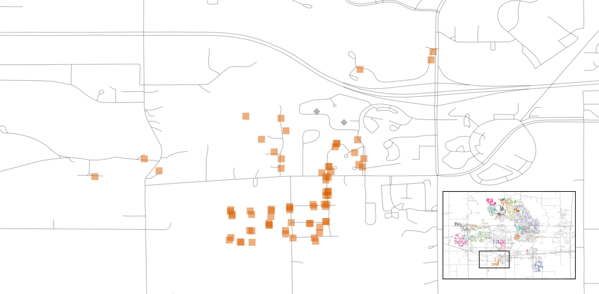
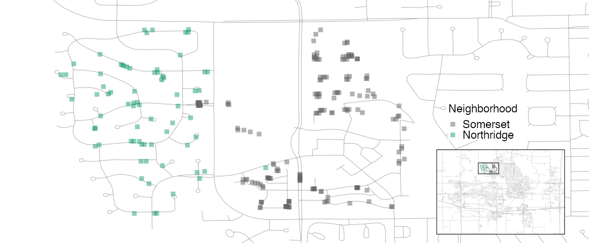

---
output_yaml:
  - _output.yml
---

<!-- Add a couple more of the chapters? Or maybe put them in chapter 11? -->

<!-- Cut the recipe, bake, stuff? Not really needed for chapters 11 and 12. -->

<!-- Replace lm() with stan_glm()? -->

<!-- Do we need to discuss `x`/`y` interface so much?  -->

<!-- Get rid of multi-category example discussion? No! Hope to do pyTorch at some point. -->

<!-- 2) Each section ends with the code we have done. That seems redundant and confusing. -->

<!-- 3) Need to make the approach here mesh with the approaches used in chapter 11 and 12. What can we cut from here that is not used? How should we change later chapters to be consistent with this modern approach? -->

<!-- 4) I am concerned about the ames_snippets.R code used in the original but, maybe, not needed here. -->


<!-- 6) Many sections begun with a weird code chunk. These should be cleaned up and organized. -->

<!-- 7) Deal with the missing references. Need to add them to the bib. -->

<!-- 8) Maybe follow their example with r pkg(dplyr) instead of **dplyr**. -->

# Model Choice

```{r, echo=FALSE}
val_list <- function(x){
  x <- format(table(x), big.mark = ",")
  x <- paste0("`", names(x), "` ($n = ", unname(x), "$)")
  knitr::combine_words(x)
}
```


Still a draft. Come back in a few weeks.

## The Ames housing data {#ames}

Start as usual:

```{r, message = FALSE}
library(tidyverse)
library(tidymodels)
data(ames)
```

The **tidymodels** library includes all the necessary libraries, in the same way that **tidyverse** includes libraries like **ggplot2** and **dplyr**. The `ames` data lives in the **modeldata** library, which is part of **tidymodels**.

The Ames housing data set is an excellent resource for learning about models. It contains data on `r format(nrow(ames), big.mark = ",")` properties in Ames, Iowa, including columns related to 

 * house characteristics (bedrooms, garage, fireplace, pool, porch, etc.),
 * location (neighborhood),
 * lot information (zoning, shape, size, etc.),
 * ratings of condition and quality, and
 * sale price.


It makes sense to start with the outcome we want to predict: the last sale price of the house (in USD): 

<!-- DK: Clean up these plots? Why not? -->

```{r}
ggplot(ames, aes(x = Sale_Price)) + 
  geom_histogram(bins = 50)
```

The data are right-skewed; there are more inexpensive houses than expensive ones. The median sale price was \$`r format(median(ames$Sale_Price), big.mark = ",")` and the most expensive house was \$`r format(max(ames$Sale_Price), big.mark = ",")`. When modeling this outcome, a strong argument can be made that the price should be log-transformed. The advantages of doing this are that no houses would be predicted with negative sale prices and that errors in predicting expensive houses will not have an undue influence on the model. Also, from a statistical perspective, a logarithmic transform may also _stabilize the variance_ in a way that makes inference more legitimate. Let's visualize the transformed data:

<!-- DK: Do we need to discuss logs, either here or earlier in the book? -->

```{r}
ggplot(ames, aes(x = Sale_Price)) + 
  geom_histogram(bins = 50) +
  scale_x_log10()
```

While not perfect, this will probably result in better models than using the untransformed data. 


The units of the model coefficients might be more difficult to interpret, as will measures of performance. For example, the root mean squared error (RMSE) is a common performance metric that is used in regression models. It uses the difference between the observed and predicted values in its calculations. If the sale price is on the log scale, these differences (i.e. the residuals) are also in log units. For this reason, it can be difficult to understand the quality of a model whose RMSE is 0.15 log units. 

Despite these drawbacks, we will utilize the log transformation for this outcome. _From this point on_, the outcome column is pre-logged in the `ames` data frame: 

```{r}
ames <- ames %>% 
  mutate(Sale_Price = log10(Sale_Price))
```

<!-- DK: Delete this interesting geographic stuff? It is good but the chapter is too long. -->

Another important aspect of these data for our modeling are their geographic locations. This spatial information is contained in the data in two ways: a qualitative `Neighborhood` label as well as quantitative longitude and latitude data. To visualize the spatial information, let's use both together to plot the data on a map and color by neighborhood: 

```{r, echo = FALSE}
knitr::include_graphics("10-model-choice/images/ames.png")
```

We can see a few noticeable patterns. First, there is a void of data points in the center of Ames. This corresponds to Iowa State University. Second, while there are a number of neighborhoods that are geographically isolated, there are others that are adjacent to each other. For example, Timberland is located apart from almost all other neighborhoods:

```{r, echo = FALSE}

```

The Meadow Village neighborhood in Southwest Ames is like an island of properties ensconced inside the sea of properties that make up the Mitchell neighborhood: 

```{r, echo = FALSE}
knitr::include_graphics("10-model-choice/images/mitchell.png")
```
 
A detailed inspection of the map also shows that the neighborhood labels are not completely reliable. For example, there are some properties labeled as being in Northridge that are surrounded by houses in the adjacent Somerset neighborhood: 

```{r, echo = FALSE}

```

Also, there are ten isolated houses labeled as being in Crawford but which are not close to the majority of the other houses in that neighborhood:

```{r, echo = FALSE}
knitr::include_graphics("10-model-choice/images/crawford.png")
```

Also notable is the "Iowa Department of Transportation (DOT) and Rail Road" neighborhood adjacent to the main road on the east side of Ames. There are several clusters of houses within this neighborhood as well as some longitudinal outliers; the two houses furthest east are isolated from the other locations. 

```{r, echo = FALSE}
knitr::include_graphics("10-model-choice/images/dot_rr.png")
```

It is _critical_ to conduct _exploratory data analysis_ prior to beginning any modeling. These housing data have characteristics that present interesting challenges about how the data should be processed and modeled. We describe many of these in later sections. Some basic questions that could be examined include: 

 * Are there any odd or noticeable things about the distributions of the individual predictors? Is there much skewness or any pathological distributions? 

 * Are there high correlations between predictors? For example, there are multiple predictors related to the size of the house. Are some redundant?

 * Are there associations between predictors and the outcomes? 

Many of these questions will be revisited as these data are used in upcoming examples. 

## Spending our data {#splitting}

There are several steps to create a useful model, including parameter estimation, model selection and tuning, and performance assessment. At the start of a new project, there is usually an initial finite pool of data available for all these tasks. How should the data be applied to these steps? The idea of _data spending_ is an important first consideration when modeling, especially as it relates to empirical validation. 

When there are copious amounts of data available, a smart strategy is to allocate specific subsets of data for different tasks, as opposed to allocating the largest possible amount to the model parameter estimation only. There may be questions about many modeling project steps that must be answered with limited prior knowledge. For example, one possible strategy (when both data and predictors are abundant) is to spend a specific subset of data to determine which predictors are informative, before considering parameter estimation at all. 

If the initial pool of data available is not huge, there will be some overlap of how and when our data is "spent" or allocated, and a solid methodology for data spending is important. Here, we demonstrate the basics of _splitting_ our initial pool of samples for different purposes. 

### Common methods for splitting data {#splitting-methods}

The primary approach for empirical model validation is to split the existing pool of data into two distinct sets. Some observations are used to develop and optimize the model. This _training set_ is usually the majority of the data. These data are a sandbox for model building where different models can be fit, feature engineering strategies are investigated, and so on. We as modeling practitioners spend the vast majority of the modeling process using the training set as the substrate to develop the model.  

The other portion of the observations are placed into the _test set_. This is held in reserve until one or two models are chosen as the methods that are mostly likely to succeed. The test set is then used as the final arbiter to determine the efficacy of the model. It is critical to only look at the test set once; otherwise, it becomes part of the modeling process. 


Suppose we allocate 80% of the data to the training set and the remaining 20% for testing.  The most common method is to use simple random sampling. The **rsample** package has tools for making data splits such as this; the function `intial_split()` was created for this purpose. It takes the data frame as an argument as well as the proportion to be placed into training. 

```{r, message = FALSE, warning = FALSE}
# Set the random number stream using `set.seed()` so that the results can be
# reproduced later.

set.seed(123)

# Save the split information for an 80/20 split of the data

ames_split <- initial_split(ames, prob = 0.80)
ames_split
```

The printed information denotes the amount of data in the training set ($n = `r format(nrow(training(ames_split)), big.mark = ",")`$), the amount in the test set ($n = `r format(nrow(testing(ames_split)), big.mark = ",")`$), and the size of the original pool of samples  ($n = `r format(nrow(ames), big.mark = ",")`$). 

The object `ames_split` is an `rsplit` object and only contains the partitioning information; to get the resulting data sets, we apply two more functions:

```{r}
ames_train <- training(ames_split)
ames_test  <-  testing(ames_split)

dim(ames_train)
```

These objects are data frames with the same _columns_ as the original data but only the appropriate _rows_ for each set. 

The amount of data that should be allocated when splitting the data is highly dependent on the context of the problem at hand. Too much data in the training set lowers the quality of the performance estimates. Conversely, too much data in the test set handicaps the model's ability to find appropriate parameter estimates. There are parts of the statistics community that eschew test sets in general because they believe all of the data should be used for parameter estimation. While there is merit to this argument, it is good modeling practice to have an unbiased set of observations as the final arbiter of model quality. A test set should be avoided only when the data are pathologically small.


## Feature engineering with recipes {#recipes}

Feature engineering encompasses activities that reformat predictor values to make them easier for a model to use effectively. This includes transformations and encodings of the data to best represent their important characteristics. Imagine that you have two predictors in a data set that can be more effectively represented in your model of interest as a ratio; creating a new predictor from the ratio of the original two is a simple example of feature engineering. 

Take the location of a house in Ames as a more involved example. There are a variety of ways that this spatial information can be exposed to a model, including neighborhood (a qualitative measure), longitude/latitude, distance to the nearest school or Iowa State University, and so on. When choosing how to encode these data in modeling, we might choose an option we believe most associated with the outcome. The original format of the data (e.g., numeric like distance versus categorical like neighborhood) is also a driving factor in feature engineering choices. 

There are many other examples of preprocessing to build better features for modeling: 

 * Correlation between predictors can be reduced via feature extraction or the removal of some predictors. 
 
 * When some predictors have missing values, they can be imputed using a sub-model.
 
 * Models that use variance-type measures may benefit from coercing the distribution of some skewed predictors to be symmetric by estimating a transformation. 

Feature engineering and data preprocessing can also involve reformatting _required_ by the model. Some models use geometric distance metrics and, consequently, numeric predictors should be centered and scaled so that they are all in the same units. Otherwise, the distance values would be biased by the scale of each column. 


The **recipes** package combines different feature engineering and preprocessing tasks into a single object and then apply these transformations to different data sets. 

### A simple recipe for the Ames housing data 

In this section, we will focus on a small subset of the predictors available in the Ames housing data: 

 * The neighborhood (qualitative, with `r length(levels(ames_train$Neighborhood))` neighborhoods in the training set)

 * The general living area (continuous, named `Gr_Liv_Area`)

 * The year built (`Year_Built`)

 * The type of building (`Bldg_Type` with values `r val_list(ames_train$Bldg_Type)`)

<!-- DK: Introduce lm here? Or earlier? -->

Suppose that an initial ordinary linear regression model were fit to these data. A  standard call to `lm()`, a function similar to `stan_glm()`, might look like:

```{r, eval = FALSE}
lm(Sale_Price ~ Neighborhood + log10(Gr_Liv_Area) + Year_Built + Bldg_Type)
```

What the formula above does can be decomposed into a series of _steps_:

1. Sale price is defined as the outcome while neighborhood, general living area, the year built, and building type variables are all defined as predictors. 

1. A log transformation is applied to the general living area predictor. 

1. The neighborhood and building type columns are converted from a non-numeric format to a numeric format (since least squares requires numeric predictors). 

The formula method will apply these data manipulations to any data, including new data, that are passed to the `predict()` function. 

A recipe is also an object that defines a series of steps for data processing. Unlike the formula method inside a modeling function, the recipe defines the steps without immediately executing them; it is only a specification of what _should_ be done. Here is a recipe equivalent to the formula above:

```{r}
library(tidymodels) # Includes the recipes package

simple_ames <- 
  recipe(Sale_Price ~ Neighborhood + Gr_Liv_Area + 
           Year_Built + Bldg_Type,
         data = ames_train) %>%
  step_log(Gr_Liv_Area, base = 10) %>% 
  step_dummy(all_nominal())
simple_ames
```

Let's break this down: 

1. The call to `recipe()` with a formula tells the recipe the _roles_ of the variables (e.g., predictor, outcome). It only uses the data to determine the data types for the columns. 

1. `step_log()` declares that `Gr_Liv_Area` should be log transformed. 

1. `step_dummy()` is used to specify which variables should be converted from a qualitative format to a quantitative format, in this case, using dummy or indicator variables. An indicator or dummy variable is a binary numeric variable (a column of ones and zeroes) that encodes qualitative information; we will dig deeper into these kinds of variables in Section \@ref(dummies). 

The function `all_nominal()` captures the names of any columns that are currently factor or character (i.e., nominal) in nature. This is a **dplyr** selector function similar to `starts_with()` or `matches()` but which can only be used inside of a recipe. 


What is the advantage to using a recipe? There are a few, including:

 * These computations can be recycled across models since they are not tightly coupled to the modeling function. 
 
 * A recipe enables a broader set of data processing choices than formulas can offer. 
 
 * The syntax can be very compact. For example, `all_nominal()` can be used to capture many variables for specific types of processing while a formula would require each to be explicitly listed. 
 
 * All data processing can be captured in a single R object instead of in scripts that are repeated, or even spread across different files.  
 
### Using recipes
 
Remember that when invoking the `recipe()` function, the steps are not estimated or executed in any way. The second phase for using a recipe is to estimate any quantities required by the steps using the `prep()` function. For example, we can use `step_normalize()` to center and scale any predictors selected in the step. When we call `prep(recipe, training)`, this function estimates the required means and standard deviations from the data in the `training` argument. The transformations specified by each step are also sequentially executed on the data set. Again using normalization as the example, the means and variances are estimated and then used to standardize the columns. 


For our example recipe, we can now `prep()`: 

```{r}
simple_ames <- prep(simple_ames, 
                    training = ames_train)
simple_ames
``` 

Note that, after preparing the recipe, the print statement shows the results of the selectors (e.g., `Neighborhood` and `Bldg_Type` are listed instead of `all_nominal`). 

The third phase of recipe usage is to apply the preprocessing operations to a data set using the `bake()` function. The `bake()` function can apply the recipe to _any_ data set. To use the test set, the syntax would be:

<!--DK: Fix the NULL problem!-->

```{r, eval=FALSE}
test_ex <- bake(simple_ames, new_data = ames_test)
names(test_ex) %>% 
  head()
```

Note the dummy variable columns starting with `Neighborhood_`. The `bake()` function can also take selectors so that, if we only wanted the neighborhood results, we could use:

<!-- DK: When do we explain starts_with() and friends? Maybe there is a preliminaries section for each chapter which teaches some more cool stuff? -->

```{r, eval = FALSE}
bake(simple_ames, 
     ames_test, 
     starts_with("Neighborhood_"))
```

To get the processed version of the training set, we use `bake()` and pass in the argument `ames_train`.

<!-- DK: Why doesn't this work? NULL seems unacceptable. -->

```{r}
bake(simple_ames, new_data = ames_train) %>% 
  nrow()

ames_train %>% 
  nrow()
```

To reiterate, using a recipe is a three phase process summarized as:

```{r, echo = FALSE}
knitr::include_graphics("10-model-choice/images/recipes-process.svg")
```


### Encoding qualitative data in a numeric format  {#dummies}

One of the most common feature engineering tasks is transforming nominal or qualitative data (factors or characters) so that they can be encoded or represented numerically. Sometimes we can alter the factor levels of a qualitative column in helpful ways _prior_ to such a transformation. For example, `step_unknown()` can be used to change missing values to a dedicated factor level. Similarly, if we anticipate that a new factor level may be encountered in future data, `step_novel()` can allot a new level for this purpose. 

Additionally, `step_other()` can be used to analyze the frequencies of the factor levels in the training set and convert infrequently occurring values to a catch-all level of "other", with a specific threshold that can be specified. A good example is the `Neighborhood` predictor in our data:

```{r}
ggplot(ames_train, aes(y = Neighborhood)) + 
  geom_bar() + 
  labs(y = NULL)
```

Here there are two neighborhoods that have less than five properties in the training data; in this case, no houses at all in the Landmark neighborhood were included in the training set. For some models, it may be problematic to have dummy variables with a single non-zero entry in the column. At a minimum, it is highly improbable that these features would be important to a model. If we add `step_other(Neighborhood, threshold = 0.01)` to our recipe, the bottom 1% of the neighborhoods will be lumped into a new level called "other". In this training set, this will catch `r sum(table(ames_train$Neighborhood)/nrow(ames_train) <= .01)` neighborhoods.  

For the Ames data, we can amend the recipe to use:

```{r}
simple_ames <- 
  recipe(Sale_Price ~ Neighborhood + Gr_Liv_Area + Year_Built + Bldg_Type,
         data = ames_train) %>%
  step_log(Gr_Liv_Area, base = 10) %>% 
  step_other(Neighborhood, threshold = 0.01) %>% 
  step_dummy(all_nominal())
```


There are a few strategies for converting a factor predictor to a numeric format. The most common method is to create "dummy" or indicator variables. Let's take the predictor in the Ames data for the building type, which is a factor variable with five levels. For dummy variables, the single `Bldg_Type` column would be replaced with four numeric columns whose values are either zero or one. These binary variables represent specific factor level values. In R, the convention is to _exclude_ a column for the first factor level (`OneFam`, in this case). The `Bldg_Type` column would be replaced with a column called `TwoFmCon` that is one when the row has that value and zero otherwise. Three other columns are similarly created: 

```{r, echo = FALSE}
show_rows <- 
  ames_train %>% 
  mutate(.row = row_number()) %>% 
  group_by(Bldg_Type) %>% dplyr::select(Bldg_Type, .row) %>% 
  slice(1) %>% 
  pull(.row)

recipe(~Bldg_Type, data = ames_train) %>% 
  step_mutate(`Raw Data` = Bldg_Type) %>% 
  step_dummy(Bldg_Type, 
             naming = function(var, lvl, ordinal = FALSE, sep = "_") lvl) %>% 
  prep() %>% 
  bake(ames_train) %>% 
  slice(show_rows) %>% 
  arrange(`Raw Data`)
```


Why not all five? The most basic reason is simplicity; if you know the value for these four columns, you can determine the last value because these are mutually exclusive categories. More technically, the classical justification is that a number of models, including ordinary linear regression, have numerical issues when there are linear dependencies between columns. If all five building type indicator columns are included, they would add up to the intercept column (if there is one). This would cause an issue, or perhaps an outright error, in the underlying matrix algebra.  

The full set of encodings can be used for some models. This is traditionally called the "one-hot" encoding and can be achieved using the `one_hot` argument of `step_dummy()`. 

Different recipe steps can have different effects on columns of the data. For example, `step_log()` modifies a column in-place without changing the name. Other steps, such as `step_dummy()` eliminate the original data column and replace it with one or more columns with different names. This behavior depends on the type of operation being done. 


### Interaction terms

Interaction effects involve two or more predictors. Such an effect occurs when one predictor has an effect on the outcome that is contingent on one or more other predictors. For example, if you were trying to predict your morning commute time, two potential predictors could be the amount of traffic and the time of day. However, the relationship between commute time and the amount of traffic is different for different times of day. In this case, you could add an interaction term between the two predictors to the model along with the original two predictors (which are called the "main effects"). Numerically, an interaction term between predictors is encoded as their product. Interactions are only defined in terms of their effect on the outcome and can be combinations of different types of data (e.g., numeric, categorical, etc). 

After exploring the Ames training set, we might find that the regression slopes for the general living area differ for different building types: 

```{r}
ggplot(ames_train, aes(x = Gr_Liv_Area, y = 10^Sale_Price)) + 
  geom_point(alpha = .2) + 
  facet_wrap(~ Bldg_Type) + 
  geom_smooth(method = lm, formula = y ~ x, se = FALSE, col = "red") + 
  scale_x_log10() + 
  scale_y_log10() + 
  labs(x = "General Living Area", y = "Sale Price (USD)")
```

How are interactions specified? Recipes are explicit and sequential. With the current recipe, `step_dummy()` has already created dummy variables. How would we combine these for an interaction? The additional step would look like `step_interact(~ interaction terms)` where the terms on the right-hand side of the tilde are the interactions. These can include selectors, so it would be appropriate to use:

```{r}
simple_ames <- 
  recipe(Sale_Price ~ Neighborhood + Gr_Liv_Area + Year_Built + Bldg_Type,
         data = ames_train) %>%
  step_log(Gr_Liv_Area, base = 10) %>% 
  step_other(Neighborhood, threshold = 0.01) %>% 
  step_dummy(all_nominal()) %>% 
  # Gr_Liv_Area is on the log scale from a previous step
  step_interact( ~ Gr_Liv_Area:starts_with("Bldg_Type_") )
```

Additional interactions can be specified in this formula by separating them by `+`. Also note that the recipe will only utilize interactions between different variables; if the formula uses `var_1:var_1`, this term will be ignored. 

<!-- DK: Delete spline discussion and usage? I am torn! -->

### Spline functions

When a predictor has a nonlinear relationship with the outcome, some types of predictive models can adaptively approximate this relationship during training. However, simpler is usually better and it is not uncommon to try to use a simple model, such as a linear fit, and add in specific non-linear features for predictors that may need them. One common method for doing this is to use _spline_ functions to represent the data. Splines replace the existing numeric predictor with a set of columns that allow a model to emulate a flexible, non-linear relationship. As more spline terms are added to the data, the capacity to non-linearly represent the relationship increases. Unfortunately, it may also increase the likelihood of picking up on data trends that occur by chance (i.e., over-fitting). 

If you have ever used `geom_smooth()` within a `ggplot`, you have probably used a spline representation of the data. For example, each panel below uses a different number of smooth splines for the latitude predictor:

<!-- DK: This is a nice plot! Why not show students how to make it? Perhaps the preiminaries for this chapter could explain patchwork? And logs? And splines? -->

```{r}
library(patchwork)
library(splines)

plot_smoother <- function(deg_free) {
  ggplot(ames_train, aes(x = Latitude, y = Sale_Price)) + 
    geom_point(alpha = .2) + 
    scale_y_log10() +
    geom_smooth(
      method = lm,
      formula = y ~ ns(x, df = deg_free),
      col = "red",
      se = FALSE
    ) +
    ggtitle(paste(deg_free, "Spline Terms"))
}

( plot_smoother(2) + plot_smoother(5) ) / ( plot_smoother(20) + plot_smoother(100) )
```

The `ns()` function in the **splines** package generates feature columns using functions called _natural splines_.

Some panels clearly fit poorly; two terms _under-fit_ the data while 100 terms _over-fit_. The panels with five and 20 terms seem like reasonably smooth fits that catch the main patterns of the data. This indicates that the proper amount of "non-linear-ness" matters. The number of spline terms could then be considered a _tuning parameter_ for this model. 

In **recipes**, there are multiple steps that can create these types of terms. To add a natural spline representation for this predictor:

```{r, eval = FALSE}
recipe(Sale_Price ~ Neighborhood + Gr_Liv_Area + Year_Built + Bldg_Type + Latitude,
         data = ames_train) %>%
  step_log(Gr_Liv_Area, base = 10) %>% 
  step_other(Neighborhood, threshold = 0.01) %>% 
  step_dummy(all_nominal()) %>% 
  step_interact( ~ Gr_Liv_Area:starts_with("Bldg_Type_") ) %>% 
  step_ns(Latitude, deg_free = 20)
```

The user would need to determine if both neighborhood and latitude should be in the model since they both represent the same underlying data in different ways.


### How data are used by the recipe

Data are given to recipes at different stages. When calling `recipe(..., data)`, the data set is used to determine the data types of each column so that selectors such as `all_numeric()` can be used. When preparing the data using `prep(recipe, training)`, the data in `training` are used for all estimation operations, from determining factor levels to computing PCA components and everything in between. It is important to realize that all preprocessing and feature engineering steps only utilize the training data. Otherwise, information leakage can negatively impact the model. 

When using `bake(recipe, new_data)`, no quantities are re-estimated using the values in `new_data`. Take centering and scaling using `step_normalize()` as an example. Using this step, the means and standard deviations from the appropriate columns are determined from the training set; new samples are standardized using these values when `bake()` is invoked. 


### Column roles

When a formula is used with the initial call to `recipes()` it assigns _roles_ to each of the column depending on which side of the tilde that they are on. Those roles are either `"predictor"` or `"outcome"`. However, other roles can be assigned as needed. 

For example, in our Ames data set, the original raw data contained a field for address. It may be useful to keep that column in the data so that, after predictions are made, problematic results can be investigated in detail. In other words, the column is important but isn't a predictor or outcome. 

To solve this, the `add_role()`, `remove_role()`, and `update_role()` functions can be helpful. For example, for the house price data, the street address column could be modified using

```r
ames_rec %>% 
  update_role(address, new_role = "street address")
```


Our code so far:

```{r, message=FALSE}
library(tidymodels)
data(ames)
ames <- mutate(ames, Sale_Price = log10(Sale_Price))

set.seed(123)
ames_split <- initial_split(ames, prob = 0.80, strata = Sale_Price)
ames_train <- training(ames_split)
ames_test  <- testing(ames_split)

ames_rec <- 
  recipe(Sale_Price ~ Neighborhood + Gr_Liv_Area + Year_Built + Bldg_Type + 
           Latitude + Longitude, data = ames_train) %>%
  step_log(Gr_Liv_Area, base = 10) %>% 
  step_other(Neighborhood, threshold = 0.01) %>% 
  step_dummy(all_nominal()) %>% 
  step_interact( ~ Gr_Liv_Area:starts_with("Bldg_Type_") ) %>% 
  step_ns(Latitude, Longitude, deg_free = 20)
```

## Fitting models with parsnip {#models}

The **parsnip** package provides a fluent and standardized interface for a variety of different models. In this section, we both give some motivation for why a common interface is beneficial and show how the use the package. 
 
### Create a model

Once the data have been encoded in a format ready for a modeling algorithm, such as a numeric matrix, they can be used in the model building process.  

Suppose that a linear regression model was our initial choice for the model. This is equivalent to specifying that the outcome data is numeric and that the predictors are related to the model in terms of simple slopes and intercepts: 

$$y_i = \beta_0 + \beta_1 x_{1i} + \ldots + \beta_p x_{pi}$$

There are a variety of methods that can be used to estimate the model parameters: 

 * _Ordinary linear regression_ uses the traditional method of least squares to solve for the model parameters. 

 * _Regularized linear regression_ adds a penalty to the least squares method to encourage simplicity by removing predictors and/or shrinking their coefficients towards zero. This can be executed using Bayesian or non-Bayesian techniques. 

In R, the **stats** package can be used for the first case. The syntax for `lm()` is 

```r
model <- lm(formula, data, ...)
```

where `...` symbolizes other options to pass to `lm()`. 

To estimate a Bayesian model, we use `stan_glm()` from the **rstanarm** package, as we have done in the last few chapters. 

```r
model <- stan_glm(formula, 
                  data, 
                  family = "gaussian", ...)
```

A popular non-Bayesian approach to regression is the glmnet model. Its syntax is:

```r
model <- glmnet(x = matrix, 
                y = vector, 
                family = "gaussian", ...)
```

In this case, the predictor data must already be formatted into a numeric matrix; there is only and `x`/`y` method and no formula method. 

Note that these interfaces are heterogeneous in either how the data are passed to the model function or in terms of their arguments. The first issue is that, to fit models across different packages, the data must be formatted in different ways. `lm()` and `stan_glm()` only have formula interfaces while `glmnet()` does not. For other types of models, the interfaces may be even more disparate. For a person trying to do data analysis, these differences require the memorization of each package's syntax and can be very frustrating. 

For tidymodels, the approach to specifying a model is intended to be more unified: 

1. **Specify the _type_ of model based on its mathematical structure**. 

2. **Specify the _engine_ for fitting the model.** Most often this reflects the software package that should be used. 

3. **When required, declare the _mode_ of the model.** The mode reflects the type of prediction outcome. For numeric outcomes, the mode is _regression_; for qualitative outcomes, it is _classification_. Note that **parsnip** constrains the outcome column of a classification models to be encoded as a _factor_; using binary numeric values will result in an error. If a model can only create one type of model, such as linear regression, the mode is already set. 

These specifications are built _without referencing the data_. For example, for the three cases above: 

```{r}
linear_reg() %>% 
  set_engine("lm")

linear_reg() %>% 
  set_engine("glmnet") 

linear_reg() %>% 
  set_engine("stan")
```


Once the details of the model have been specified, the model estimation can be done using a formula with the `fit()` function. The **parsnip** package allows the user to be indifferent to the interface of the underlying model. 


Let's walk through how to predict the sale price of houses in the Ames data as a function of only longitude and latitude. 


```{r}
lm_model <- 
  linear_reg() %>% 
  set_engine("lm")

# Recall that Sale_Price has been pre-logged

lm_form_fit <- 
  lm_model %>% 
  fit(Sale_Price ~ Longitude + Latitude, data = ames_train)
    
lm_form_fit
```


Not only does **parsnip** enable a consistent model interface for different packages, it also provides consistency in the _model arguments_. Modeling functions in **parsnip** separate model arguments into two categories: 

 * _Main arguments_ are more commonly used and tend to be available across engines. 

 * _Engine arguments_ are either specific to a particular engine or used more rarely. 


### Use the model results

Once the model is created and fit, we can use the results in a variety of ways; we might want to plot, print, or otherwise examine the model output. Several quantities are stored in a **parsnip** model object, including the fitted model. This can be found in an element called `fit`, which can be returned using the `purrr::pluck()` function:

<!-- DK: Investigate pluck nonsense. -->

```{r}
lm_form_fit %>% 
  purrr::pluck("fit")
```

Normal methods can be applied to this object, such as printing, plotting, and so on.

One issue with some existing methods in base R is that the results are stored in a manner that may not be the most useful. As a solution, the **broom** package has methods to convert many types of model objects to a tidy structure. For example, using the `tidy()` method on the linear model produces:


```{r}
tidy(lm_form_fit)
```
 
The column names are standardized across models and do not contain any additional data (such as the type of statistical test). The data previously contained in the row names are now in a column called `terms` and so on. One important principle in the tidymodels ecosystem is that a function should return values that are _predictable, consistent, and unsurprising_. 


### Make predictions {#parsnip-predictions}

Another area where **parsnip** diverges from conventional R modeling functions is the format of values returned from `predict()`. For predictions, **parsnip** always conforms to the following rules: 

 1. The results are always a tibble.
 2. The column names of the tibble are always predictable. 
 3. There are always as many rows in the tibble as there are in the input data set. 

For example, when numeric data are predicted: 

```{r}
ames_test_small <- ames_test %>% slice(1:5)
predict(lm_form_fit, new_data = ames_test_small)
```

The row order of the predictions are always the same as the original data. Why is there a leading dot in some of the column names? Some tidyverse and tidymodels arguments and return values contain periods. This is to protect against merging data with duplicate names. There are some data sets that contain predictors named `pred`! 


These three rules make it easier to merge predictions with the original data: 

```{r}
ames_test_small %>% 
  select(Sale_Price) %>% 
  bind_cols(predict(lm_form_fit, ames_test_small)) %>% 
  
  # Add 95% prediction intervals to the results:
  
  bind_cols(predict(lm_form_fit, ames_test_small, type = "pred_int")) 
```

The motivation for the first rule comes from some R packages producing dissimilar data types from prediction functions. For example, the **ranger** package is an excellent tool for computing random forest models. However, instead of returning a data frame or vector as output, a specialized object is returned that has multiple values embedded within it (including the predicted values). This is just one more step for the data analyst to work around in their scripts. As another example, the **glmnet** package can return at least four different output types for predictions, depending on the model and characteristics of the data: 

| Type of Prediction       | Returns a:                      |
|--------------------------|---------------------------------|
| numeric                  | numeric matrix                  |
| class                    | _character_ matrix              |
| probability (2 classes)  | numeric matrix (2nd level only) |
| probability (3+ classes) | 3D numeric array (all levels)   |

Additionally, the column names of the results contain coded values that map to a vector called `lambda` within the glmnet model object. This excellent statistical method can be discouraging to use in practice because of all of the special cases an analyst might encounter that require additional code to be useful.

For the second tidymodels prediction rule, the predictable column names for different types of predictions are: 

```{r, echo = FALSE}
  tribble(
    ~ `type value`, ~ `column name(s)`,
    "`numeric`", "`.pred`",
    "`class`", "`.pred_class`",
    "`prob`", "`.pred_{class levels}`",
    "`conf_int`", "`.pred_lower`, `.pred_upper`",
    "`pred_int`", "`.pred_lower`, `.pred_upper`"
  ) 
```

The third rule regarding the number of rows in the output is critical. For example, if any rows of the new data contain missing values, the output will be padded with missing results for those rows. 

A main advantage of standardizing the model interface and prediction types in **parsnip** is that, when different models are used, the syntax is identical. Suppose that we used a decision tree to model the Ames data. Outside of the model specification, there are no significant differences in the code pipeline: 

```{r}
tree_model <- 
  decision_tree(min_n = 2) %>% 
  set_engine("rpart") %>% 
  set_mode("regression")

tree_fit <- 
  tree_model %>% 
  fit(Sale_Price ~ Longitude + Latitude, data = ames_train)

ames_test_small %>% 
  select(Sale_Price) %>% 
  bind_cols(predict(tree_fit, ames_test_small))
```

This demonstrates the benefit of homogenizing the data analysis process and syntax across different models. It enables the user to spend their time on the results and interpretation rather than having to focus on the syntactical differences between R packages. 


## A model workflow {#workflows}

In the previous two sections, we discussed the **recipes** and **parsnip** packages. These packages can be used to prepare the data for analysis and fitting the model. This chapter introduces a new object called a _model workflow_. The purpose of this object is to encapsulate the major pieces of the modeling _process_. The workflow is important in two ways. First, using a workflow object encourages good methodology since it is a single point of entry to the estimation components of a data analysis. Second, it enables the user to better organize their projects.  


### Where does the model begin and end? {#begin-model-end}

So far, when we have used the term "the model", we have meant a structural equation that relates some predictors to one or more outcomes. Let's consider again linear regression as an example. The outcome data are denoted as $y_i$, where there are $i = 1 \ldots n$ samples in the training set. Suppose that there are $p$ predictors $x_{i1}, \ldots, x_{ip}$ that are used in the model. Linear regression produces a model equation of 

$$ \hat{y}_i = \hat{\beta}_0 + \hat{\beta}_1x_{i1} + \ldots + \hat{\beta}_px_{ip} $$

While this is a _linear_ model, it is only linear in the parameters. The predictors could be nonlinear terms like $log(x_i)$. 

For some data sets that are straightforward in nature, fitting the model itself may be the entire process. However, there are a variety of choices and additional steps that often occur _before_ the model is fit:

* While our example model has $p$ predictors, it is common to start with more than $p$ candidate predictors. Through exploratory data analysis or using domain knowledge, some of the predictors may be excluded from the analysis. In other cases, a feature selection algorithm may be used to make a data-driven choice for the minimum predictor set for the model. 

* There are times when the value of an important predictor is missing. Rather than eliminating this sample from the data set, the missing value could be _imputed_ using other values in the data. For example, if $x_1$ were missing but was correlated with predictors $x_2$ and $x_3$, an imputation method could estimate the missing $x_1$ observation from the values of $x_2$ and $x_3$. 

* It may be beneficial to transform the scale of a predictor. If there is not _a priori_ information on what the new scale should be, we can estimate the proper scale using a statistical transformation technique, the existing data, and some optimization criterion. Other transformations, such as PCA, take groups of predictors and transform them into new features that are used as the predictors.

While the examples above are related to steps that occur before the model fit, there may also be operations that occur _after_ the model is created. When a classification model is created where the outcome is binary (e.g., `event` and `non-event`), it is customary to use a 50% probability cutoff to create a discrete class prediction, also known as a "hard prediction". For example, a classification model might estimate that the probability of an event was 62%. Using the typical default, the hard prediction would be `event`. However, the model may need to be more focused on reducing false positive results (i.e., where true non-events are classified as events). One way to do this is to raise the cutoff from 50% to some greater value. This increases the level of evidence required to call a new sample an event. While this reduces the true positive rate (which is bad), it may have a more dramatic effect on reducing false positives. The choice of the cutoff value should be optimized using data. This is an example of a _post-processing_ step that has a significant effect on how well the model works, even though it is not contained in the model fitting step. 

It is important to focus on the broader _modeling process_, instead of only fitting the specific model used to estimate parameters. This broader process includes any preprocessing steps, the model fit itself, as well as potential post-processing activities. In this book, we will refer to this broader process as the **model workflow** and include in it any data-driven activities that are used to produce a final model equation. 


In other software, such as Python or Spark, similar collections of steps are called  _pipelines_. In tidymodels, the term "pipeline" already connotes a sequence of operations chained together with a pipe operator (such as `%>%`). Rather than using ambiguous terminology in this context, we call the sequence of computational operations related to modeling **workflows**. 


Binding together the analytical components of a data analysis is important for another reason. We will learn how to accurately measure performance, as well as how to optimize structural parameters (i.e. model tuning). To correctly quantify model performance on the training set, we recommend using _resampling_ methods. To do this properly, no data-driven parts of the analysis should be excluded from validation. To this end, the workflow must include all significant estimation steps.

To illustrate, consider PCA signal extraction. This is a way to replace correlated predictors with new artificial features that are uncorrelated and capture most of the information in the original set. The new features would be used as the predictors and least squares regression could be used to estimate the model parameters. 

There are two ways of thinking about the model workflow. The _incorrect_ method would be to think of the PCA preprocessing step as _not being part of the modeling process_: 

```{r, echo = FALSE}
knitr::include_graphics("10-model-choice/images/bad-workflow.svg")
```

The fallacy here is that, although PCA does significant computations to produce the components, its operations are assumed to have no uncertainty associated with them. The PCA components are treated as _known_ and, if not included in the model workflow, the effect of PCA could not be adequately measured. 

An _appropriate_ approach would be: 

```{r, echo = FALSE}
knitr::include_graphics("10-model-choice/images/proper-workflow.svg")
```

In this way, the PCA preprocessing is considered part of the modeling process. 

### Workflow basics

The **workflows** package allows the user to bind modeling and preprocessing objects together. Let's start again with the Ames data and a simple linear model:

```{r}
library(tidymodels)  # Includes the workflows package

lm_model <- 
  linear_reg() %>% 
  set_engine("lm")
```

A workflow always requires a **parsnip** model object:

```{r}
lm_wflow <- 
  workflow() %>% 
  add_model(lm_model)

lm_wflow
```

Notice that we have not yet specified how this workflow should preprocess the data: `Preprocessor: None`.

If our model were very simple, a standard R formula can be used as a preprocessor: 

```{r workflows-form}
lm_wflow <- 
  lm_wflow %>% 
  add_formula(Sale_Price ~ Longitude + Latitude)

lm_wflow
```

Workflows have a `fit()` method that can be used to create the model. Using the objects created previously:

```{r}
lm_fit <- fit(lm_wflow, ames_train)
lm_fit
```

We can also `predict()` on the fitted workflow:

```{r}
predict(lm_fit, ames_test %>% slice(1:3))
```

The `predict()` method follows all of the same rules and naming conventions that we described for the **parsnip** package. 


### Workflows and recipes

<!-- DK: Simplify this. No need to teach update() stuff trickery. -->

Instead of using model formulas, recipe objects can also be used to preprocess data for modeling. Previously, we summarized a recipe that specified several preprocessing and feature engineering steps. These are encapsulated inside the object `ames_rec` and are attached to the workflow:

```{r, error = TRUE}
lm_wflow %>% 
  add_recipe(ames_rec)
```

That did not work! We can only have one preprocessing method at a time, so we need to remove the formula before adding the recipe. 

```{r workflows-add-recipe}
lm_wflow <- 
  lm_wflow %>% 
  remove_formula() %>% 
  add_recipe(ames_rec)
lm_wflow
```

Use `fit()` to complete the model and `predict()` to create predictions from the fitted model.


```{r}
lm_fit <- fit(lm_wflow, ames_train)

predict(lm_fit, ames_test %>% slice(1:3))
```

We have learned that the modeling process encompasses more than just estimating the parameters of an algorithm that connects predictors to an outcome. This process also includes preprocessing steps and operations taken after a model is fit. We introduced a concept called a **model workflow** that can capture the important components of the modeling process. 

For the Ames data, the updated code:

```{r, message=FALSE}
library(tidymodels)
data(ames)

ames <- mutate(ames, Sale_Price = log10(Sale_Price))

set.seed(123)
ames_split <- initial_split(ames, prob = 0.80, strata = Sale_Price)
ames_train <- training(ames_split)
ames_test  <-  testing(ames_split)

ames_rec <- 
  recipe(Sale_Price ~ Neighborhood + Gr_Liv_Area + Year_Built + Bldg_Type + 
           Latitude + Longitude, data = ames_train) %>%
  step_log(Gr_Liv_Area, base = 10) %>% 
  step_other(Neighborhood, threshold = 0.01) %>% 
  step_dummy(all_nominal()) %>% 
  step_interact( ~ Gr_Liv_Area:starts_with("Bldg_Type_") ) %>% 
  step_ns(Latitude, Longitude, deg_free = 20)

lm_model <- linear_reg() %>% set_engine("lm")

lm_wflow <- 
  workflow() %>% 
  add_model(lm_model) %>% 
  add_recipe(ames_rec)

lm_fit <- fit(lm_wflow, ames_train)
```

## Judging model effectiveness {#performance}


Once we have a model, we need to know how well it works. A quantitative approach for estimating effectiveness allows us to understand the model, to compare different models, or to tweak the model to improve performance. Our focus in tidymodels is on _empirical validation_; this usually means using data that were not used to create the model as the substrate on which we measure effectiveness. 


The choice of which metrics to examine can be critical. For example, two common metrics for regression models are the root mean squared error (RMSE) and the coefficient of determination (a.k.a. $R^2$). The former measures _accuracy_ while the latter measures _correlation_. These are not necessarily the same thing. This figure demonstrates the difference between the two: 

```{r, echo = FALSE}
set.seed(234)
n <- 200
obs <- runif(n, min = 2, max = 20)

reg_ex <- 
  tibble(
    observed = c(obs, obs),
    predicted = c(obs + rnorm(n, sd = 1.5), 5 + .5 * obs + rnorm(n, sd = .5)),
    approach = rep(c("RMSE optimized", "R^2 optimized"), each = n)
  ) %>% 
  mutate(approach = factor(approach, levels = c("RMSE optimized", "R^2 optimized")))

ggplot(reg_ex, aes(x = observed, y = predicted)) + 
  geom_abline(lty = 2) + 
  geom_point(alpha = 0.5) + 
  coord_obs_pred() + 
  facet_wrap(~ approach)
```

A model optimized for RMSE has more variability but has relatively uniform accuracy across the range of the outcome. The right panel shows that there is a tighter correlation between the observed and predicted values but this model performs poorly in the tails. 

This section will largely focus on the **yardstick** package. Before illustrating syntax, let's explore whether empirical validation using performance metrics is worthwhile when a model is focused on inference rather than prediction. 

### Performance metrics and inference

<!-- DK: We could put these sections at the start of their respective chapters. -->

The effectiveness of any given model depends on how the model will be used. An inferential model is used primarily to understand relationships, and typically is discussed with a strong focus on the choice (and validity) of probabilistic distributions and other generative qualities that define the model. For a model used primarily for prediction, by contrast, predictive strength is primary and concerns about underlying statistical qualities may be less important. Predictive strength is usually focused on how close our predictions come to the observed data, i.e., fidelity of the model predictions to the actual results. This section focuses on functions that can be used to measure predictive strength. However, our advice for those developing inferential models is to use these techniques _even when the model will not be used with the primary goal of prediction_. 

A longstanding issue with the practice of inferential statistics is that, with a focus purely on inference, it is difficult to assess the credibility of a model. For example, consider Alzheimer's disease data used to study the factors that influence cognitive impairment. Assume that we build a model, using the standard statistical approach. We would, normally, not even be required to calculate how closely this model fits the actual data. 

Using resampling methods, we can estimate the accuracy of this model to be about 73.3%. Accuracy is often a poor measure of model performance; we use it here because it is commonly understood. If the model has 73.3% fidelity to the data, should we trust the conclusions produced by the model? We might think so until we realize that the baseline rate of non-impaired patients in the data is 72.7%. This means that, despite our statistical analysis, a fancy model appears to be *only 0.6% better than a simple heuristic that always predicts patients to be unimpaired*, irregardless of the observed data. 

<!-- DK: Never seen this sort of object before. -->

```{block, type = "rmdnote"}
The point of this analysis is to demonstrate the idea that **optimization of statistical characteristics of the model does not imply that the model fits the data well.** Even for purely inferential models, some measure of fidelity to the data should accompany the inferential results. Using this, the consumers of the analyses can calibrate their expectations of the results of the statistical analysis. 
```

<!-- DK: Next edition: Bring back multi-classification -->

In the remainder of this section, general approaches for evaluating models via empirical validation are discussed. These approaches are grouped by the nature of the outcome data: purely numeric (Chapter \@ref(continuous-response)) and binary classes (Chapter \@ref(discrete-response)). 

### Regression metrics 

Recall from Section \@ref(parsnip-predictions) that tidymodels prediction functions produce tibbles with columns for the predicted values. These columns have consistent names, and the functions in the **yardstick** package that produce performance metrics have consistent interfaces. The functions are data frame-based, as opposed to vector-based, with the general syntax of: 

```r
function(data, truth, ...)
```

where `data` is a data frame or tibble and `truth` is the column with the observed outcome values. The ellipses or other arguments are used to specify the column(s) containing the predictions. 


To illustrate, let's evaluate the model we have constructed for the Ames house price data. Recall that the `lm_fit` object was a linear regression model whose predictor set was supplemented with an interaction and spline functions for longitude and latitude. It was created from a training set (named `ames_train`). Although we do not advise using the test set at this juncture of the modeling process, it will be used to illustrate functionality and syntax. The data frame `ames_test` consists of `r nrow(ames_test)` properties. To start, let's produce predictions: 

<!-- DK: Is this correct? The pipe within new_data? -->

```{r}
ames_test_res <- predict(lm_fit, new_data = ames_test %>% 
                           select(-Sale_Price))
ames_test_res
```

The predicted numeric outcome from the regression model is named `.pred`. Let's match the predicted values with their corresponding observed outcome values: 

```{r}
ames_test_res <- bind_cols(ames_test_res, ames_test %>% select(Sale_Price))
ames_test_res
```

Note that both the predicted and observed outcomes are in log10 units. It is best practice to analyze the predictions on the transformed scale (if one were used) even if the predictions are reported using the original units. 

Let's plot the data before computing metrics: 

```{r}
ggplot(ames_test_res, aes(x = Sale_Price, y = .pred)) + 
  # Create a diagonal line:
  geom_abline(lty = 2) + 
  geom_point(alpha = 0.5) + 
  labs(y = "Predicted Sale Price (log10)", x = "Sale Price (log10)") +
  # Scale and size the x- and y-axis uniformly:
  coord_obs_pred()
```

There is one property that is substantially over-predicted. 

Let's compute the root mean squared error for this model using the `rmse()` function: 

```{r}
rmse(ames_test_res, truth = Sale_Price, estimate = .pred)
```

The output above shows the standard format of the output of **yardstick** functions. Metrics for numeric outcomes usually have a value of "standard" for the `.estimator` column. Examples with different values for this column are shown below.

To compute multiple metrics at once, we can create a _metric set_. Let's add $R^2$ and the mean absolute error: 

```{r}
ames_metrics <- metric_set(rmse, rsq, mae)
ames_metrics(ames_test_res, truth = Sale_Price, estimate = .pred)
```

This tidy data format stacks the metrics vertically. 


### Binary classification metrics 

To illustrate other ways to measure model performance, we will switch to a different example. The **modeldata** package contains example predictions from a test data set with two classes ("Class1" and "Class2"):

```{r performance-two-class-example}
data(two_class_example)
str(two_class_example)
```

The second and third columns are the predicted class probabilities for the test set while `predicted` are the discrete predictions. 

For the hard class predictions, there are a variety of **yardstick** functions that are helpful: 

```{r performance-class-metrics}
# A confusion matrix: 
conf_mat(two_class_example, truth = truth, estimate = predicted)

accuracy(two_class_example, truth = truth, estimate = predicted)

# Matthews correlation coefficient:
mcc(two_class_example, truth, predicted)

# F1 metric:
f_meas(two_class_example, truth, predicted)
```

For binary classification data sets, these functions have a standard argument called `event_level`. The _default_ is that the **first** level of the outcome factor is the event of interest. 

```{block, type = "rmdnote"}
There is some heterogeneity in R functions in this regard; some use the first level and others the second to denote the event of interest. We consider it more intuitive that the first level is the most important. The second level logic is borne of encoding the outcome as 0/1 (in which case the second value is the event) and unfortunately remains in some packages. However, tidymodels (along with many other R packages) _require_ a categorical outcome to be encoded as a factor and, for this reason, the legacy justification for the second level as the event becomes irrelevant.  
```

As an example where the second class is the event: 

```{r}
f_meas(two_class_example, truth, predicted, event_level = "second")
```

In the output above, the `.estimator` value of "binary" indicates that the standard formula for binary classes will be used. 

There are numerous classification metrics that use the predicted probabilities as inputs rather than the hard class predictions. For example, the receiver operating characteristic (ROC) curve computes the sensitivity and specificity over a continuum of different event thresholds. The predicted class column is not used. There are two **yardstick** functions for this method: `roc_curve()` computes the data points that make up the ROC curve and `roc_auc()` computes the area under the curve. 

The interfaces to these types of metric functions use the `...` argument placeholder to pass in the appropriate class probability column. For two-class problems, the probability column for the event of interest is passed into the function:

```{r}
two_class_curve <- roc_curve(two_class_example, truth, Class1)
two_class_curve

roc_auc(two_class_example, truth, Class1)
```

The `two_class_curve` object can be used in a `ggplot` call to visualize the curve. There is an `autoplot()` method that will take care of the details:

```{r performance-2class-roc-curve}
autoplot(two_class_curve)
```

There are a number of other functions that use probability estimates, including `gain_curve()`, `lift_curve()`, and `pr_curve()`. 


## Conclusion

The **tidymodels** package provides the most popular and sophisticated tools for making models in R. This chapter has provided a whirlwind tour. Don't worry if you did not understand every detail! We will spend the last two chapters of the book practicing.
